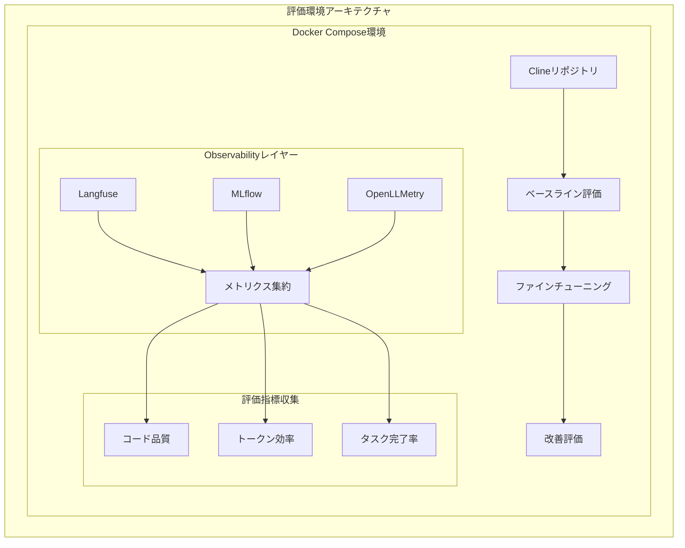
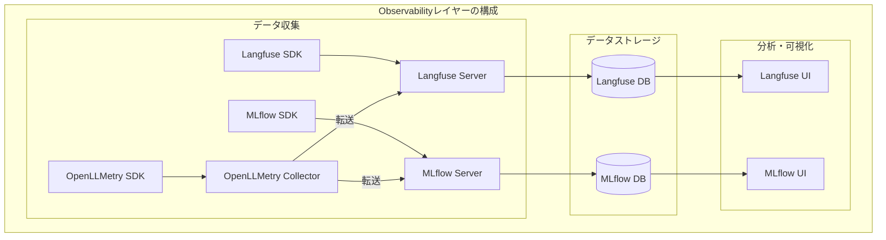
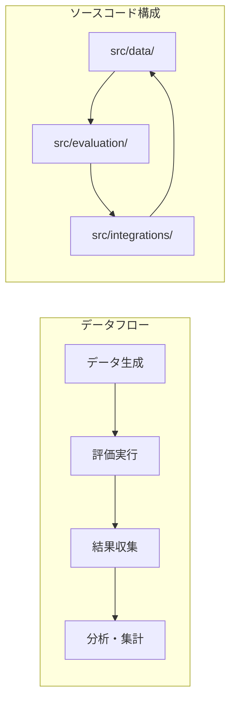
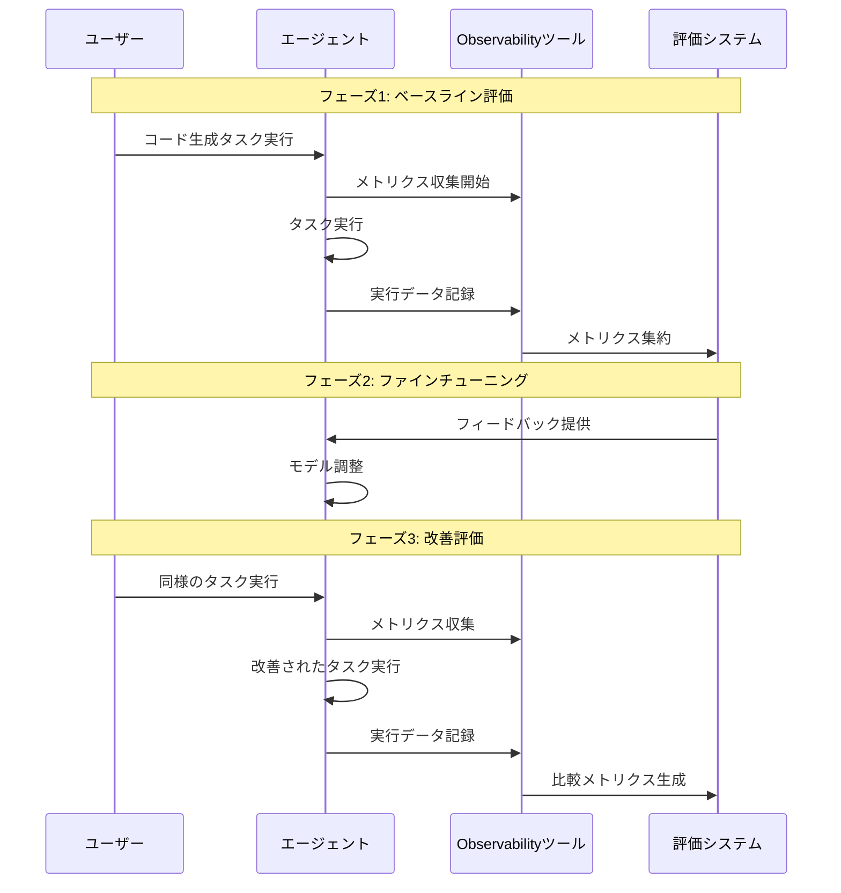

# LLMOps Code Generation Evaluation

## プロジェクト概要

このプロジェクトは、Clineリポジトリを題材としたLLMのコード生成能力の評価と、効率的なファインチューニングによるトークン使用量の最適化を目的としています。

主な目標：
1. **コード生成能力の定量的評価**
   - 生成されたコードの品質測定
   - ベストプラクティスへの準拠度確認
   - エラー率と修正必要性の分析

2. **トークン使用量の最適化**
   - 効率的なプロンプト設計
   - コンテキスト管理の改善
   - 応答生成の最適化

3. **観測性（Observability）の向上**
   - 詳細な実行トレースの収集
   - パフォーマンス指標の測定
   - 問題箇所の特定と改善

## システムアーキテクチャ

### 全体構成



### Observabilityレイヤー詳細



### 評価システム構成



## ツールの役割と関係性

### 機能比較

| 機能 | Langfuse | MLflow | OpenLLMetry |
|------|----------|--------|-------------|
| トレース収集 | ✅ LLM特化 | ❌ | ✅ 汎用 |
| メトリクス収集 | ✅ | ✅ | ✅ |
| プロンプト管理 | ✅ | ❌ | ❌ |
| 実験管理 | ❌ | ✅ | ❌ |
| モデル管理 | ❌ | ✅ | ❌ |
| 分散トレーシング | ❌ | ❌ | ✅ |
| コスト分析 | ✅ | ❌ | ❌ |
| カスタムメトリクス | ✅ | ✅ | ✅ |

### データフロー

1. **OpenLLMetry**
   - システム全体の分散トレーシングを担当
   - 各コンポーネント間の通信を監視
   - 収集したデータをLangfuseとMLflowに転送

2. **Langfuse**
   - LLM実行の詳細なトレースを保存
   - プロンプトとレスポンスの履歴を管理
   - コストとトークン使用量を追跡

3. **MLflow**
   - 実験結果とメトリクスを保存
   - モデルのバージョンを管理
   - ファインチューニングの進捗を追跡

## プロジェクト構成

```
.
├── docs/                          # プロジェクトドキュメント
│   ├── evaluation-plan.md         # 評価計画の詳細
│   └── progress.md               # 進捗状況の追跡
├── llmops-evaluation/            # LLM評価実装ディレクトリ
│   ├── src/                      # ソースコード
│   │   ├── data/                # データ生成・管理
│   │   ├── evaluation/          # 評価ロジック
│   │   └── integrations/        # 外部ツール統合
│   ├── data/                    # 生成されたデータ
│   └── results/                 # 評価結果
├── docker-compose.yml           # Docker環境設定
└── openllmetry-collector-config.yaml  # OpenLLMetry設定
```

## セットアップ手順

### 1. 基本環境構築

```bash
# リポジトリのクローン - 評価環境の基盤を準備
git clone [repository-url]
cd llmops-code-generation-sample

# Docker Compose環境の起動 - 各ツールのサーバーを起動
docker-compose up -d
```

### 2. 各ツールの設定

#### Langfuse設定
```bash
# Langfuse環境変数の設定 - LLMのトレース収集を有効化
cp .env.example .env
# .envファイルを編集してLangfuseの認証情報を設定
```

#### MLflow設定
```bash
# MLflow用のデータディレクトリ作成 - 実験データの保存先を準備
mkdir -p mlflow/data

# MLflow環境変数の設定 - 実験管理サーバーへの接続を設定
export MLFLOW_TRACKING_URI=http://localhost:5000
```

#### OpenLLMetry設定
```bash
# OpenLLMetry Collector設定の確認 - トレース収集の設定を確認
cat openllmetry-collector-config.yaml
```

### 3. 依存関係のインストール

```bash
# 評価スクリプト実行に必要なパッケージをインストール
cd llmops-evaluation
pip install -r requirements.txt
```

### 4. 評価環境の準備

```bash
# 評価データと結果の保存先を作成
mkdir -p data/raw data/processed results

# 評価スクリプトの実行権限を設定
chmod +x src/evaluation/runner.py
```

## 評価指標

### 1. コード品質メトリクス

- **コードの一貫性**
  - 命名規則の遵守率
  - コードスタイルの一貫性
  - 構造化の度合い

- **ベストプラクティスの遵守率**
  - デザインパターンの適切な使用
  - エラーハンドリングの実装
  - ドキュメンテーションの充実度

- **エラー率**
  - 構文エラーの発生頻度
  - ランタイムエラーの発生頻度
  - 修正必要箇所の数

### 2. 効率性メトリクス

- **トークン使用量**
  - プロンプトのトークン数
  - レスポンスのトークン数
  - コンテキストウィンドウの使用効率

- **タスク完了時間**
  - プロンプト生成時間
  - レスポンス生成時間
  - 修正・調整時間

- **メモリ使用量**
  - ピークメモリ使用量
  - 平均メモリ使用量
  - メモリリーク検出

### 3. Observabilityメトリクス

- **トレーサビリティ**
  - エラー発生箇所の特定
  - パフォーマンスボトルネックの検出
  - 依存関係の可視化

- **デバッグ容易性**
  - ログの詳細度
  - エラーメッセージの明確さ
  - トレースの連続性

- **メトリクス取得の粒度**
  - 時系列データの収集間隔
  - イベントの捕捉率
  - カスタムメトリクスの定義

## 実装フロー



## 注意事項

- 各ステップでのメトリクス収集を確実に実施
- ツール間の比較データを適切に保存
- 各ツールの設定値を適切に管理
- Docker Compose環境の状態を定期的に確認
- 各ツールのログを定期的に確認し、問題の早期発見に努める