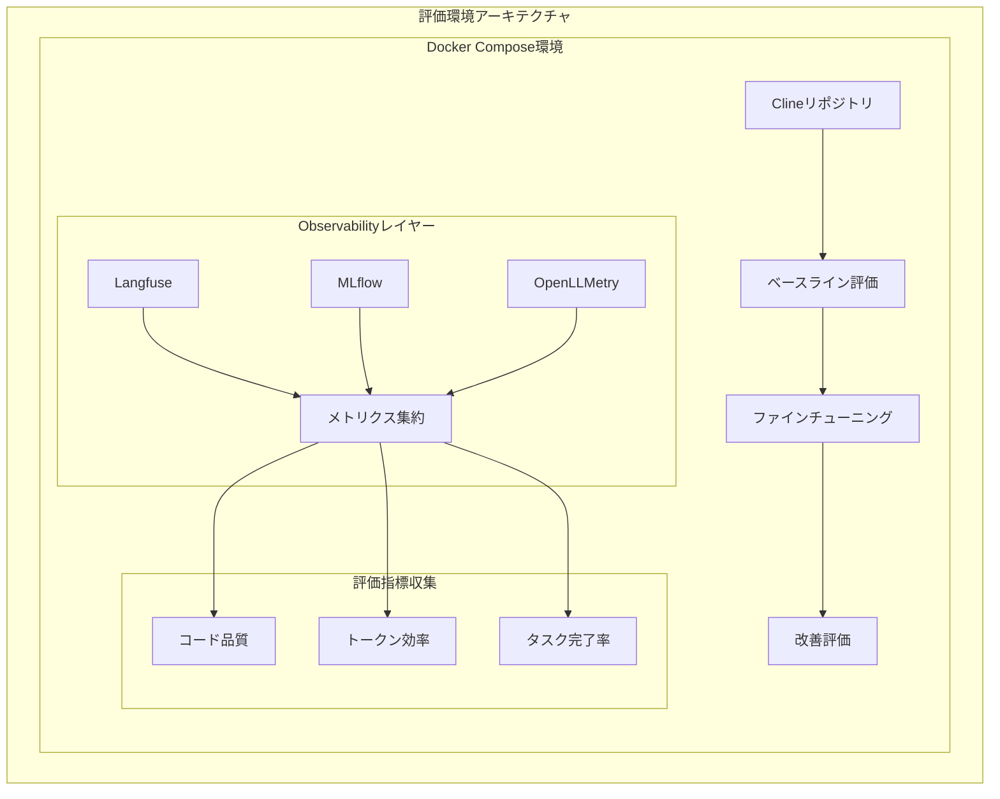
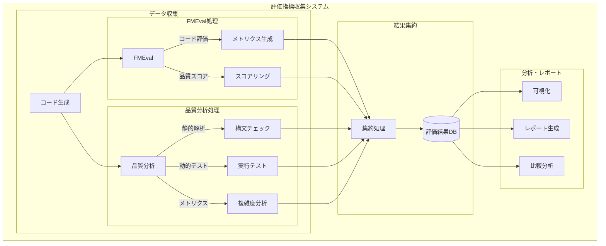
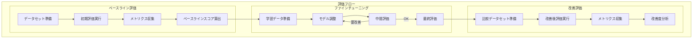
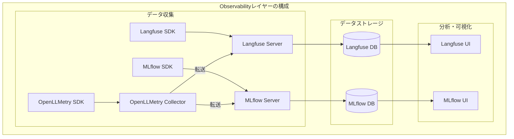
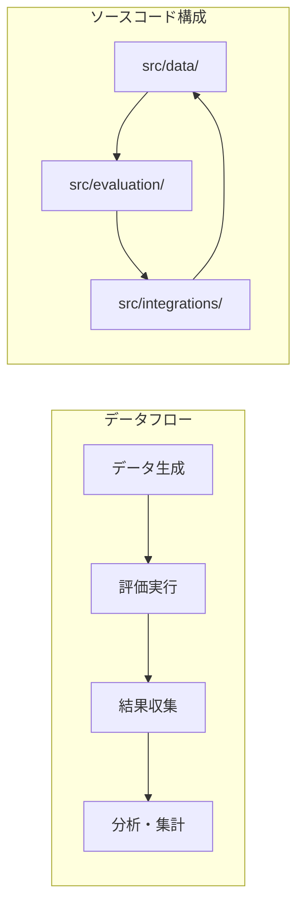
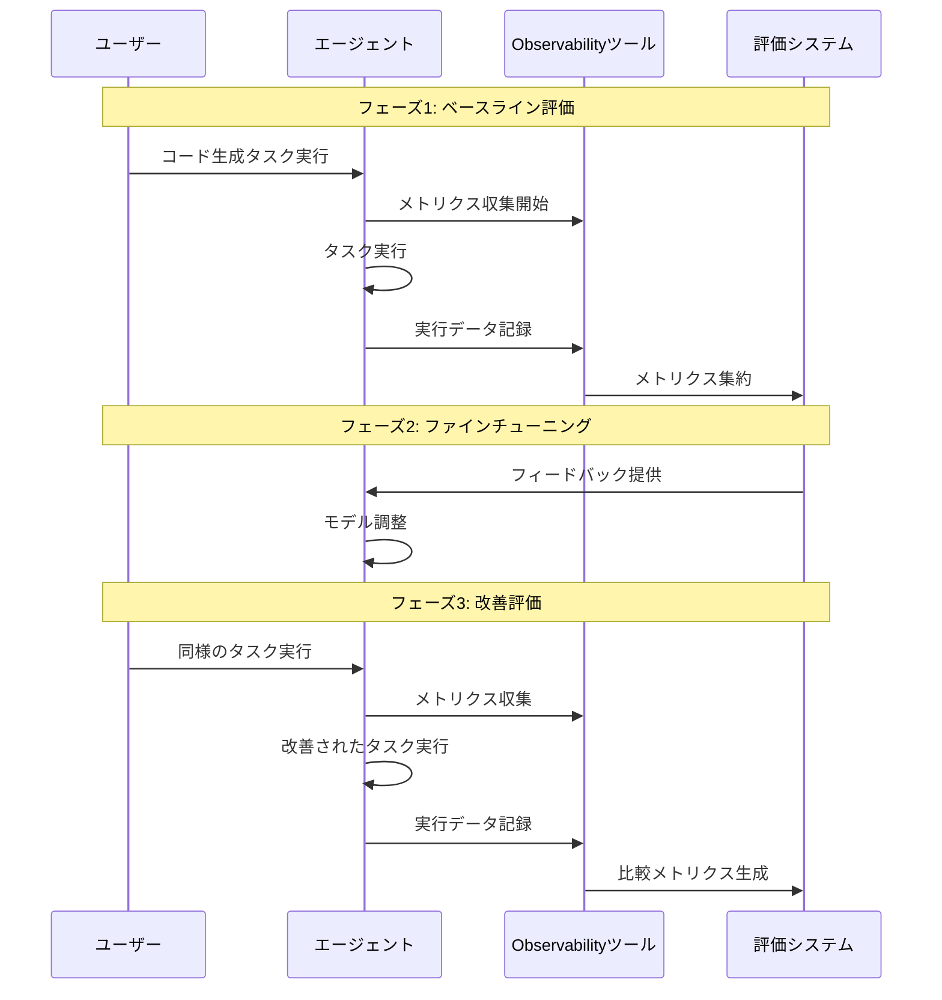

# LLMOps Code Generation Evaluation

## プロジェクト概要

このプロジェクトは、Clineリポジトリを題材としたLLMのコード生成能力の評価と、効率的なファインチューニングによるトークン使用量の最適化を目的としています。

主な目標：
1. **コード生成能力の定量的評価**
   - 生成されたコードの品質測定
   - ベストプラクティスへの準拠度確認
   - エラー率と修正必要性の分析

2. **トークン使用量の最適化**
   - 効率的なプロンプト設計
   - コンテキスト管理の改善
   - 応答生成の最適化

3. **観測性（Observability）の向上**
   - 詳細な実行トレースの収集
   - パフォーマンス指標の測定
   - 問題箇所の特定と改善

## システムアーキテクチャ

### 全体構成



### 評価指標収集システム



### ベースライン評価・ファインチューニングフロー



### Observabilityレイヤー詳細



### 評価システム構成



## ツールの役割と関係性

### 機能比較

| 機能 | Langfuse | MLflow | OpenLLMetry |
|------|----------|--------|-------------|
| トレース収集 | ✅ LLM特化 | ❌ | ✅ 汎用 |
| メトリクス収集 | ✅ | ✅ | ✅ |
| プロンプト管理 | ✅ | ❌ | ❌ |
| 実験管理 | ❌ | ✅ | ❌ |
| モデル管理 | ❌ | ✅ | ❌ |
| 分散トレーシング | ❌ | ❌ | ✅ |
| コスト分析 | ✅ | ❌ | ❌ |
| カスタムメトリクス | ✅ | ✅ | ✅ |
| ログ収集 | ✅ LLM特化 | ✅ 実験ログ | ✅ システムログ |

### データフロー

1. **OpenLLMetry**
   - システム全体の分散トレーシングを担当
   - 各コンポーネント間の通信を監視
   - システムレベルのログとトレースを収集
   - 収集したデータをLangfuseとMLflowに転送

2. **Langfuse**
   - LLM実行の詳細なトレースを保存
   - プロンプトとレスポンスの履歴を管理
   - LLM特化のログとトレースを収集
   - コストとトークン使用量を追跡

3. **MLflow**
   - 実験結果とメトリクスを保存
   - モデルのバージョンを管理
   - 実験関連のログを収集
   - ファインチューニングの進捗を追跡

## プロジェクト構成

```
.
├── docs/                          # プロジェクトドキュメント
│   ├── evaluation-plan.md         # 評価計画の詳細
│   └── progress.md               # 進捗状況の追跡
├── llmops-evaluation/            # LLM評価実装ディレクトリ
│   ├── src/                      # ソースコード
│   │   ├── data/                # データ生成・管理
│   │   ├── evaluation/          # 評価ロジック
│   │   └── integrations/        # 外部ツール統合
│   ├── data/                    # 生成されたデータ
│   └── results/                 # 評価結果
├── docker-compose.yml           # Docker環境設定
└── openllmetry-collector-config.yaml  # OpenLLMetry設定
```

## セットアップ手順

### 1. 基本環境構築

```bash
# リポジトリのクローン - 評価環境の基盤を準備
git clone [repository-url]
cd llmops-code-generation-sample

# Docker Compose環境の起動 - 各ツールのサーバーを起動
docker-compose up -d
```

### 2. 各ツールの設定

#### Langfuse設定
```bash
# Langfuse環境変数の設定 - LLMのトレース収集を有効化
cp .env.example .env
# .envファイルを編集してLangfuseの認証情報を設定
```

#### MLflow設定
```bash
# MLflow用のデータディレクトリ作成 - 実験データの保存先を準備
mkdir -p mlflow/data

# MLflow環境変数の設定 - 実験管理サーバーへの接続を設定
export MLFLOW_TRACKING_URI=http://localhost:5000
```

#### OpenLLMetry設定
```bash
# OpenLLMetry Collector設定の確認 - トレース収集の設定を確認
cat openllmetry-collector-config.yaml
```

### 3. 依存関係のインストール

```bash
# 評価スクリプト実行に必要なパッケージをインストール
cd llmops-evaluation
pip install -r requirements.txt
```

### 4. 評価環境の準備

```bash
# 評価データと結果の保存先を作成
mkdir -p data/raw data/processed results

# 評価スクリプトの実行権限を設定
chmod +x src/evaluation/runner.py
```

## 評価指標

### コード品質メトリクス

| カテゴリ | メトリクス | 説明 |
|---------|------------|------|
| コードの一貫性 | 命名規則遵守率 | 定義された命名規則に従っているコードの割合 |
| | コードスタイル一貫性 | スタイルガイドラインへの準拠度 |
| | 構造化度 | コードの論理的な構造化の度合い |
| ベストプラクティス | デザインパターン適用 | 適切なデザインパターンの使用率 |
| | エラーハンドリング | 例外処理の適切な実装率 |
| | ドキュメント充実度 | ドキュメントの完全性と品質 |
| エラー率 | 構文エラー | 発生した構文エラーの数 |
| | ランタイムエラー | 実行時に発生したエラーの数 |
| | 修正必要箇所 | 修正が必要なコード箇所の数 |

### 効率性メトリクス

| カテゴリ | メトリクス | 説明 |
|---------|------------|------|
| トークン使用量 | プロンプトトークン数 | 入力プロンプトのトークン数 |
| | レスポンストークン数 | 生成された応答のトークン数 |
| | コンテキスト効率 | コンテキストウィンドウの使用効率 |
| タスク完了時間 | プロンプト生成時間 | プロンプト作成に要した時間 |
| | レスポンス生成時間 | 応答生成に要した時間 |
| | 修正時間 | コード修正に要した時間 |
| メモリ使用量 | ピークメモリ | 最大メモリ使用量 |
| | 平均メモリ | 平均メモリ使用量 |
| | メモリリーク | 検出されたメモリリークの数 |

### Observabilityメトリクス

| カテゴリ | メトリクス | 説明 |
|---------|------------|------|
| トレーサビリティ | エラー特定 | エラー発生箇所の特定精度 |
| | ボトルネック検出 | パフォーマンス問題の検出率 |
| | 依存関係可視化 | システム依存関係の把握度 |
| デバッグ容易性 | ログ詳細度 | ログ情報の詳細さと有用性 |
| | エラーメッセージ | エラーメッセージの明確さ |
| | トレース連続性 | トレース情報の連続性 |
| メトリクス粒度 | データ収集間隔 | メトリクス収集の時間間隔 |
| | イベント捕捉率 | システムイベントの捕捉率 |
| | カスタムメトリクス | カスタム定義された指標の数 |

## 実装フロー



## 注意事項

- 各ステップでのメトリクス収集を確実に実施
- ツール間の比較データを適切に保存
- 各ツールの設定値を適切に管理
- Docker Compose環境の状態を定期的に確認
- 各ツールのログを定期的に確認し、問題の早期発見に努める