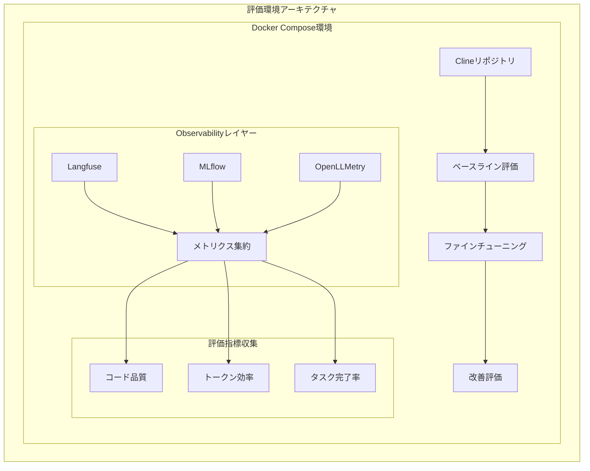
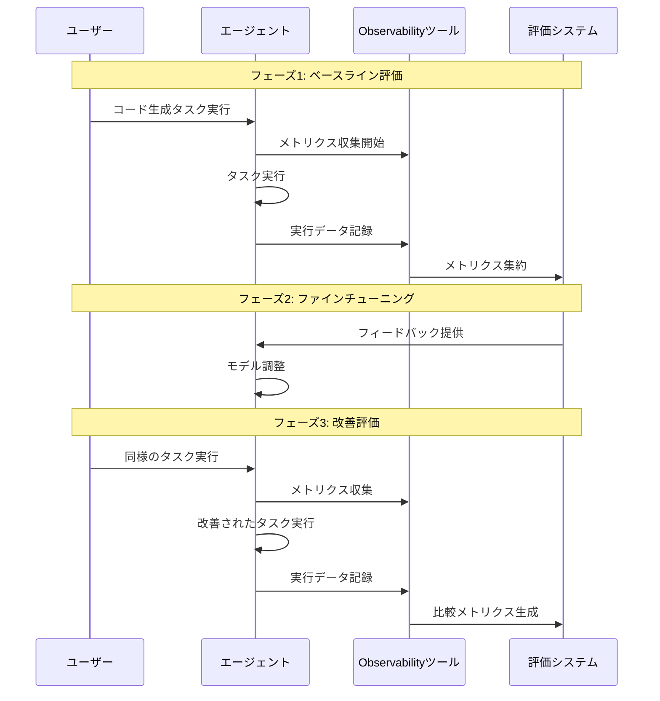

# LLMOps Code Generation Evaluation

このプロジェクトは、Clineリポジトリを題材としたLLMのコード生成能力の評価と、効率的なファインチューニングによるトークン使用量の最適化を目的としています。

## アーキテクチャ



## プロジェクト構成

```
.
├── docs/                          # プロジェクトドキュメント
│   ├── evaluation-plan.md         # 評価計画の詳細
│   └── progress.md               # 進捗状況の追跡
├── llmops-evaluation/            # LLM評価実装ディレクトリ
│   ├── src/                      # ソースコード
│   │   ├── data/                # データ生成・管理
│   │   ├── evaluation/          # 評価ロジック
│   │   └── integrations/        # 外部ツール統合
│   ├── data/                    # 生成されたデータ
│   └── results/                 # 評価結果
├── docker-compose.yml           # Docker環境設定
└── openllmetry-collector-config.yaml  # OpenLLMetry設定
```

## 主要コンポーネント

### 1. Observabilityツール

- **Langfuse**
  - LLMの実行トレース収集
  - プロンプトとレスポンスの分析
  - コスト追跡

- **MLflow**
  - 実験管理
  - モデルのバージョン管理
  - メトリクスの追跡

- **OpenLLMetry**
  - 分散トレーシング
  - メトリクス集約
  - ログ収集

### 2. 評価システム

- **データ生成 (`src/data/`)**
  - テストデータセットの生成
  - データの前処理

- **評価ロジック (`src/evaluation/`)**
  - コード品質評価
  - 効率性メトリクス計算
  - ファインチューニング実行

- **外部ツール統合 (`src/integrations/`)**
  - 各Observabilityツールとの連携
  - データ収集・送信

## 現在の開発状況

### 完了タスク ✅
- 評価計画の策定
  - 全体アーキテクチャの設計
  - 評価指標の定義
  - 実装ステップの定義

### 進行中タスク 🔄
- 基本環境構築
  - Docker Compose環境の準備
  - 各ツールのコンテナ設定

### 次のステップ 📝
1. Docker Compose環境の構築
   - 各サービスのコンテナ定義
   - ネットワーク設定
   - ボリューム設定
   - 環境変数の設定

2. 各ツールの統合
   - Langfuse設定と接続確認
   - MLflow設定と接続確認
   - OpenLLMetry設定と接続確認

3. 今後の実装予定
   - 評価スクリプトの作成
   - ベースライン測定
   - ファインチューニング実施
   - 比較評価の実行

## セットアップ手順

### 1. 基本環境構築

```bash
# リポジトリのクローン
git clone [repository-url]
cd llmops-code-generation-sample

# Docker Compose環境の起動
docker-compose up -d
```

### 2. 各ツールの設定

#### Langfuse設定
```bash
# Langfuse環境変数の設定
cp .env.example .env
# .envファイルを編集してLangfuseの認証情報を設定
```

#### MLflow設定
```bash
# MLflow用のデータディレクトリ作成
mkdir -p mlflow/data

# MLflow環境変数の設定
export MLFLOW_TRACKING_URI=http://localhost:5000
```

#### OpenLLMetry設定
```bash
# OpenLLMetry Collector設定の確認
cat openllmetry-collector-config.yaml
```

### 3. 依存関係のインストール

```bash
cd llmops-evaluation
pip install -r requirements.txt
```

### 4. 評価環境の準備

```bash
# データディレクトリの作成
mkdir -p data/raw data/processed results

# 評価スクリプトの実行権限設定
chmod +x src/evaluation/runner.py
```

## 評価指標

### 1. コード品質メトリクス
- コードの一貫性
- ベストプラクティスの遵守率
- エラー率

### 2. 効率性メトリクス
- トークン使用量
- タスク完了時間
- メモリ使用量

### 3. Observabilityメトリクス
- トレーサビリティ
- デバッグ容易性
- メトリクス取得の粒度

## 実装フロー



## 注意事項

- 各ステップでのメトリクス収集を確実に実施
- ツール間の比較データを適切に保存
- 進捗状況を定期的に更新
- 各ツールの設定値を適切に管理
- Docker Compose環境の状態を定期的に確認
- 各ツールのログを定期的に確認し、問題の早期発見に努める