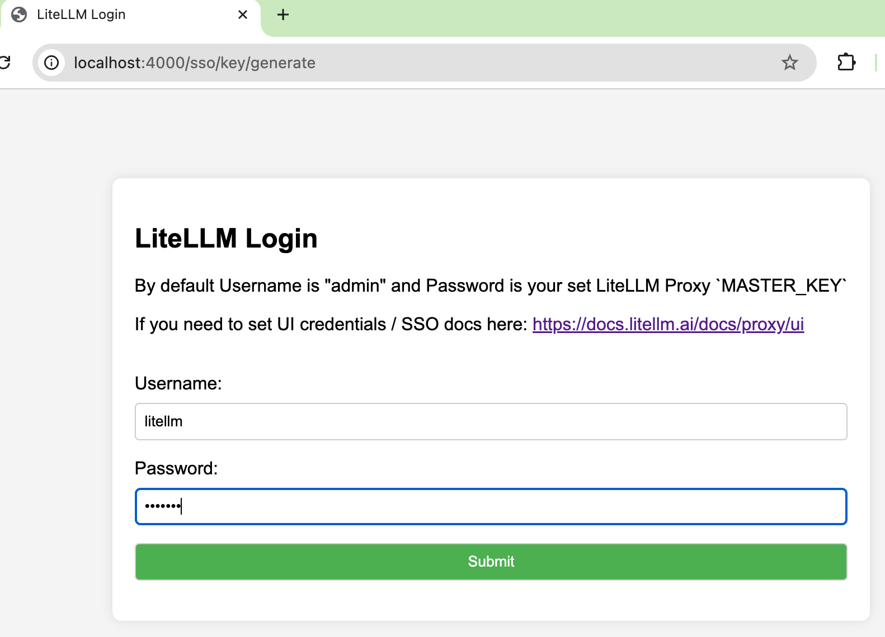

# LiteLLM Proxy

LiteLLM を使用して Amazon Bedrock 上の Claude (Sonnet 3.7、3.5) を利用するためのサーバーです。エラーが発生した場合は自動的にフォールバックする機能を備えています。

## Amazon Bedrock へのアクセス方法

LiteLLM Proxy を介した Amazon Bedrock へのアクセスには、以下の 2 つの方法があります。実行環境や要件に応じて適切な方法を選択してください。
詳細な要件は[こちら](../0.setup/requirements.md)を参照してください。

| 実行環境 | AWS アクセス方法 | 設定ファイル | 認証情報 | .env 作成方法 |
|---------|------------|------------|---------|------------|
| Amazon EC2 | AWS IAM ロール（推奨） | iam_role_config.yml | Amazon EC2 インスタンスプロファイル<br>（AWS CloudFormation で自動設定済み） | `cp .env.example .env` |
| Amazon EC2 |  AWS アクセスキー | default_config.yml | `~/.aws/credentials` の<br>[default] プロファイル | `../scripts/setup_env.sh` |
| ローカル PC |  AWS アクセスキー | default_config.yml | `~/.aws/credentials` | 手動で `.env` にアクセスキーを設定 |

### 1. EC2 インスタンスプロファイル利用（EC2 環境での推奨方法）

Amazon EC2 インスタンスに AWS IAM ロールを割り当てることで、アクセスキーを使用せずに Amazon Bedrock にアクセスできます。この方法には以下のメリットがあります：

- セキュリティの向上：アクセスキーをコード内や環境変数で管理する必要がない
- 運用の簡素化：アクセスキーのローテーションが不要
- 監査の容易さ：IAM ロールの権限変更履歴を追跡可能
- 最小権限の原則：必要な権限のみを付与可能

#### セットアップ手順

1. .env ファイルの作成
```bash
# AWS IAM ロールを使用する場合、アクセスキーの設定は不要です
cp .env.example .env
```

2. .env ファイルの設定確認
```bash
# .env ファイル内で以下の設定を確認
CONFIG_FILE="iam_role_config.yml"
```

3. サービスの起動
```bash
# 既存のサービスを停止してから起動（docker コマンドに sudo が必要な場合は sudo をつける）
./manage-litellm.sh start
```

### 2. アクセスキー利用

AWS CLI のプロファイルにアクセスキーを設定して利用する方法です。

#### 前提条件
- AWS CLI がインストールされていること
- `~/.aws/credentials` に有効なアクセスキーが設定されていること（[default] プロファイル）

#### セットアップ手順

1. .env ファイルの作成
```bash
../scripts/setup_env.sh  # AWS CLIの認証情報から自動設定
```

このスクリプトは以下の処理を実行します：
- .env.example をコピーして .env ファイルを作成
- AWS 認証情報（アクセスキー）を取得して .env ファイルに設定

2. .env ファイルの設定確認
```bash
# .env ファイル内で以下の設定を確認
CONFIG_FILE="default_config.yml"
```

3. サービスの起動とテスト
```bash
# サービスの起動
sudo ./manage-litellm.sh start

# LiteLLM Proxy 動作確認
export LITELLM_MASTER_KEY=sk-litellm-test-key
curl http://localhost:4000/v1/models \
  -H "Authorization: Bearer ${LITELLM_MASTER_KEY}"
```

## 環境要件

- Docker
- Python 3.9 以上
- AWS 認証情報（Bedrock へのアクセス権限必須）

## セットアップ手順

1. 設定ファイルの説明

`default_config.yml` では以下の設定が可能です：

- モデルの優先順位とフォールバック設定
- 各モデルの最大トークン数
- リトライ設定
- レート制限

詳細な設定例は[設定例](#設定例)セクションを参照してください。

2. サービスの起動

```bash
# サービスの起動
./manage-litellm.sh start

# サービスの停止
./manage-litellm.sh stop

# サービスの再起動
./manage-litellm.sh restart

# ヘルプの表示
./manage-litellm.sh --help
```

3. 動作確認

```bash
export LITELLM_MASTER_KEY=sk-litellm-test-key

# モデル一覧の取得
curl http://localhost:4000/v1/models \
  -H "Authorization: Bearer ${LITELLM_MASTER_KEY}"

# 基本的な補完リクエスト
curl -X POST 'http://0.0.0.0:4000/chat/completions' \
-H 'Content-Type: application/json' \
-H "Authorization: Bearer ${LITELLM_MASTER_KEY}" \
-d '{
      "model": "bedrock-converse-us-claude-3-7-sonnet-v1",
      "messages": [
        {
          "role": "user",
          "content": "what llm are you"
        }
      ]
    }'

# フォールバックのテスト
curl -X POST 'http://0.0.0.0:4000/chat/completions' \
-H 'Content-Type: application/json' \
-H "Authorization: Bearer ${LITELLM_MASTER_KEY}" \
-d '{
  "model": "bedrock-converse-us-claude-3-7-sonnet-v1",
  "messages": [
    {
      "role": "user",
      "content": "ping"
    }
  ],
  "mock_testing_fallbacks": true
}'
```

## Cline での LiteLLM 設定

### LiteLLM Proxy を Cline に接続する方法

1. Cline の設定画面から「API Provider」セクションを開きます
2. 「Add Provider」ボタンをクリックします
3. 以下の情報を入力します：
   - **Provider Type**: LiteLLM
   - **Name**: 任意の識別名（例：「Local LiteLLM Proxy」）
   - **API Key**: 環境変数 `LITELLM_MASTER_KEY` で設定した値（例：`sk-litellm-test-key`）
   - **Base URL**: `http://localhost:4000`
   - **Model ID**: LiteLLM Proxy で利用可能なモデル ID（例：`bedrock-converse-us-claude-3-7-sonnet-v1`）
     - 利用可能なモデル ID は以下のコマンドで確認できます：
     ```bash
     curl http://localhost:4000/v1/models \
       -H "Authorization: Bearer ${LITELLM_MASTER_KEY}"
     ```
4. 「Save」ボタンをクリックして設定を保存します

### 重要な注意事項

- **Extended thinking オプション**: Claude 3.7 Sonnet V1 を使用する場合、Cline の「Enable extended thinking」オプションをオフにしないと推論がエラーになる場合があります
- **ポートフォワーディング**: Amazon EC2 環境で作業している場合、VS Code のポートフォワーディング（4000→4000）を設定することで、ローカルブラウザから LiteLLM 管理画面にアクセスできます

この設定により、Cline はエラー発生時に LiteLLM Proxy を介してフェイルオーバーする構成となります。複数のモデルを設定している場合、LiteLLM の設定ファイルで指定した優先順位に従ってフォールバックが行われます。

設定完了後、簡単なタスクを実行して動作確認することをお勧めします。


## LiteLLM 管理画面（Admin UI）

LiteLLM には、サービスの監視や管理を行うための Web インターフェースが用意されています。この管理画面では、モデルの一覧確認、使用状況の分析、ログの閲覧などが可能です。

### アクセス方法

1. LiteLLM Proxy が起動している状態で、ブラウザから以下の URL にアクセスします：
   ```
   http://localhost:4000/ui
   ```

2. ログイン画面が表示されます。認証情報は `.env` ファイルに設定した値を使用します。

### デフォルトの認証情報

`.env` ファイルに認証情報を設定していない場合は、デフォルト値が使用されます：

```
# 設定例
UI_USERNAME=litellm
UI_PASSWORD=litellm
```



### 主な機能

#### モデル一覧

利用設定したモデルとその設定情報を確認できます。Setting 画面ではフォールバック設定やモデルの優先順位を設定することが可能です。


#### 使用状況分析

API の使用状況や料金情報を確認できます。期間別の使用量やコスト分析が可能です。


## ログ機能

LiteLLM のログ機能では、以下の情報が確認できます：

### デフォルトのログ設定

| ログタイプ | デフォルトで記録 |
|------------|-----------------|
| 成功ログ | ✅ はい |
| エラーログ | ✅ はい |
| リクエスト/レスポンスの内容 | ❌ いいえ（デフォルトでは無効） |

デフォルトでは、LiteLLM はリクエストとレスポンスの内容（プロンプトや回答の本文）を記録しません。

### リクエスト/レスポンス内容のログ記録を有効にする方法

ログページでリクエストとレスポンスの内容を表示したい場合は、以下の設定を `default_config.yml` に追加する必要があります：

```yaml
general_settings:
  store_prompts_in_spend_logs: true
```

この設定を有効にすると、ログページで各リクエストの詳細な内容（プロンプトや回答）を確認できるようになります。


## Prompt Caching 機能

Amazon Bedrock の [Prompt Caching](https://docs.aws.amazon.com/bedrock/latest/userguide/prompt-caching.html) 機能を使用すると、同一のプロンプトに対する応答をキャッシュし、API コールを削減することができます。これにより、以下のメリットが得られます：

- レスポンス時間の短縮
- API 使用量とコストの削減

### Amazon Bedrock Claude 3.7 Sonnet v1 での Prompt Caching

コーディング能力の高さから Cline と相性の良い Amazon Bedrock Claude 3.7 Sonnet v1 でも Prompt Caching 機能が利用可能になりました。Cline の API Provider から直接 Amazon Bedrock を指定して Prompt Caching を利用することができますし、API Provider として LiteLLM を選択した場合でも Prompt Caching を利用することができます。

専用の設定ファイル `prompt_caching.yml` を使用し Cline 設定画面上で有効化することで、簡単に利用できます。


### Amazon EC2 上での利用方法

Amazon EC2 インスタンス上で Prompt Caching を利用する場合は、以下の手順で設定します：

1. Prompt Caching 設定ファイルを指定して LiteLLM を起動
```bash
./manage-litellm.sh -c prompt_caching.yml start
```

### アクセスキーによる利用方法

アクセスキーを用いて Prompt Caching を利用する場合は、`prompt_caching.yml` にAWS 認証情報の設定が必要です。
詳細は LiteLLM Proxy の[公式ドキュメント](https://docs.litellm.ai/docs/simple_proxy)を参照ください。

1. Prompt Caching 設定ファイルを指定して LiteLLM を起動
```bash
./manage-litellm.sh -c prompt_caching.yml start
```

2. Cline の設定で LiteLLM Proxy を API Provider として設定

### 重要な注意事項 (2025/04/11 時点)

1. **モデルの可用性**：
   - Claude 3.7 Sonnet v1 は us-east-1 リージョンで cross region inference を有効にするケースのみで利用可能です。
   - モデルアクセスを有効化する場合は、us-east-1、us-east-2、us-west-2 すべてのリージョンで Claude 3.7 Sonnet v1 を有効化することを推奨します。

2. **モデルの特性と互換性**：
   - Claude 3.7 Sonnet v1 は高精度なコーディングが可能で、Prompt Caching 機能も利用できます。
   - Claude 3.5 Sonnet v2 は高精度なコーディングが可能ですが Prompt Caching 機能に対応していません。

3. **フォールバック設定の注意点**：
   - LiteLLM Proxy 経由で利用する場合、Prompt Caching が有効にできないモデル（例：Claude 3.5 Sonnet v2）を fallbacks に指定するとエラーが発生します。
   - フォールバック設定を行う場合は、Prompt Caching 対応モデルのみを指定するようにしてください。
