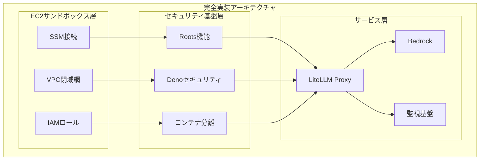
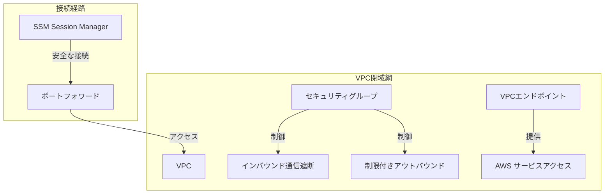
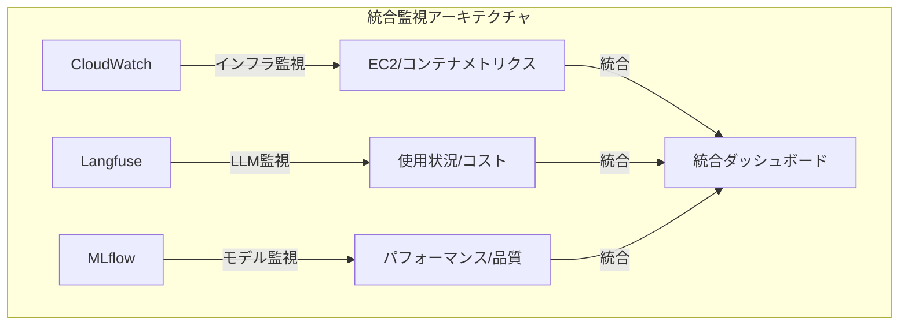
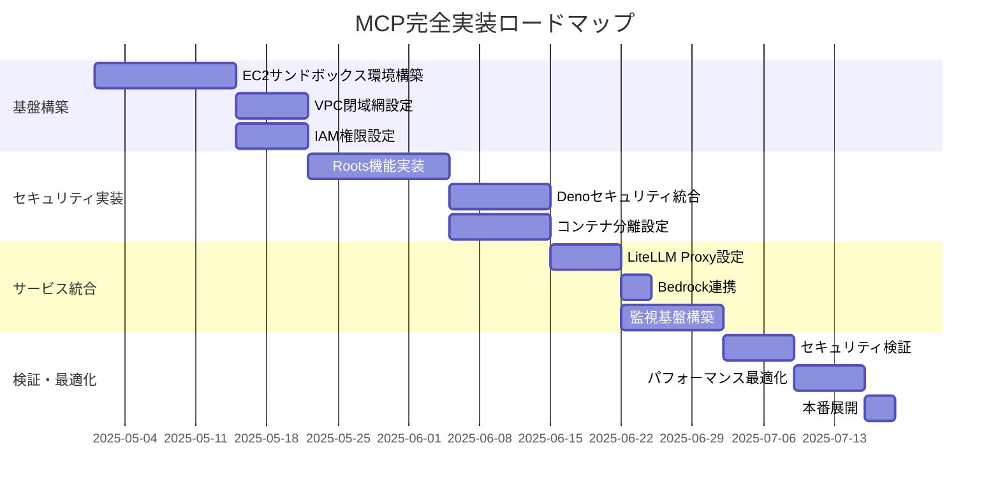

# MCP完全実装セキュリティアーキテクチャ

## 1. 完全実装アーキテクチャ概要



## 2. 保護レイヤーと実装コンポーネント

### 2.1 完全実装後の保護レベル

| 保護レイヤー | 実装コンポーネント | 保護レベル | 主な対策 |
|------------|------------------|-----------|---------|
| ネットワーク | VPC + SSM | 99% | - インバウンド通信遮断<br>- 暗号化通信<br>- エンドポイント制御 |
| アプリケーション | Roots + Deno | 95% | - 境界定義<br>- パーミッション制御<br>- サンドボックス化 |
| 実行環境 | EC2 + コンテナ | 98% | - 環境分離<br>- リソース制御<br>- アクセス制限 |
| 認証・認可 | IAM + RBAC | 97% | - 多要素認証<br>- 最小権限原則<br>- アクセス監査 |
| 監視・検知 | CloudWatch + Langfuse | 96% | - リアルタイム監視<br>- 異常検知<br>- 自動対応 |

### 2.2 機能統合マトリックス

| 機能カテゴリ | EC2環境 | セキュリティ基盤 | サービス層 |
|------------|---------|----------------|------------|
| アクセス制御 | SSM/IAM | Roots/Deno | LiteLLM RBAC |
| 分離レベル | VPC閉域 | コンテナ | アカウント分離 |
| 監視機能 | CloudWatch | 変更検知 | Langfuse/MLflow |
| リソース制限 | インスタンスタイプ | コンテナリソース | TPM/RPM制限 |
| 認証機能 | IAM/SSO | 証明書検証 | Virtual Key |

### 2.3 リスク軽減効果

| リスクカテゴリ | 実装前 | 基本実装 | 完全実装 |
|--------------|--------|----------|----------|
| 外部攻撃 | 高 | 中 | 極小 |
| データ漏洩 | 高 | 低 | 極小 |
| 権限昇格 | 中 | 低 | 極小 |
| Tool Poisoning | 高 | 中 | 極小 |
| Rug Pull攻撃 | 高 | 中 | 極小 |
| MITM攻撃 | 高 | 低 | 極小 |

## 3. EC2サンドボックス環境の詳細

### 3.1 ネットワークセキュリティ



#### 主要セキュリティ機能

- **インバウンド通信の完全遮断**
  - セキュリティグループによるすべてのインバウンド通信のブロック
  - インターネットゲートウェイの非接続

- **SSM Session Managerによる安全な接続**
  - IAM認証に基づくアクセス制御
  - 暗号化された通信チャネル
  - セッションログの記録と監査

- **VPCエンドポイントによるサービスアクセス**
  - インターネットを経由しないAWSサービスへの直接接続
  - エンドポイントポリシーによるアクセス制御
  - 通信経路の暗号化

### 3.2 IAMによるアクセス制御

```yaml
# EC2インスタンスプロファイル例
{
  "Version": "2012-10-17",
  "Statement": [
    {
      "Effect": "Allow",
      "Action": [
        "bedrock:InvokeModel",
        "bedrock:InvokeModelWithResponseStream"
      ],
      "Resource": [
        "arn:aws:bedrock:*:*:model/anthropic.claude-3-*"
      ]
    },
    {
      "Effect": "Allow",
      "Action": [
        "logs:CreateLogGroup",
        "logs:CreateLogStream",
        "logs:PutLogEvents"
      ],
      "Resource": "arn:aws:logs:*:*:log-group:/aws/ec2/mcp-sandbox/*"
    }
  ]
}
```

## 4. セキュリティ基盤層の統合

### 4.1 Roots機能とDenoセキュリティの統合

```yaml
# Roots + Deno統合設定例
roots:
  - uri: "file:///app/trusted"
    name: "信頼済みツール格納場所"
    permissions:
      deno:
        allow-read: true
        allow-write: false
  
  - uri: "https://api.example.com"
    name: "検証済みAPIエンドポイント"
    permissions:
      deno:
        allow-net: "api.example.com"
```

### 4.2 コンテナ分離とEC2の統合

```yaml
# Docker Compose設定例
version: '3'
services:
  mcp-server:
    image: mcp-server:latest
    security_opt:
      - no-new-privileges:true
    cap_drop:
      - ALL
    cap_add:
      - NET_BIND_SERVICE
    read_only: true
    tmpfs:
      - /tmp
    environment:
      - DENO_FLAGS=--allow-net=api.example.com --allow-read=/app/data --allow-env=API_KEY
    volumes:
      - /app/data:/app/data:ro
    networks:
      - mcp-network

networks:
  mcp-network:
    driver: bridge
```

## 5. サービス層の統合

### 5.1 LiteLLM Proxyの設定

```yaml
# LiteLLM Proxy設定例
model_list:
  - model_name: bedrock-claude-3-7-sonnet
    litellm_params:
      model: bedrock/anthropic.claude-3-7-sonnet-20250218-v1:0
      aws_region: us-east-1

litellm_settings:
  success_callback: ["langfuse"]
  
router_settings:
  routing_strategy: usage_based
  
litellm_callbacks:
  langfuse:
    langfuse_public_key: ${LANGFUSE_PUBLIC_KEY}
    langfuse_secret_key: ${LANGFUSE_SECRET_KEY}
```

### 5.2 監視基盤の統合



## 6. 完全実装の効果

### 6.1 セキュリティ成熟度の向上

| 評価項目 | 実装前 | 基本実装 | EC2完全実装 |
|---------|--------|----------|------------|
| 境界定義 | ⚠️ 不明確 | ✅ Roots実装 | ✅✅ VPC+Roots |
| アクセス制御 | ❌ なし | ✅ Deno制御 | ✅✅ IAM+Deno |
| 実行環境分離 | ⚠️ 部分的 | ✅ コンテナ化 | ✅✅ EC2+コンテナ |
| 通信保護 | ❌ なし | ⚠️ 基本TLS | ✅✅ VPC+SSM+TLS |
| 監視体制 | ❌ なし | ⚠️ 基本ログ | ✅✅ 統合監視 |
| インシデント対応 | ❌ なし | ⚠️ 手動対応 | ✅✅ 自動検知+対応 |

### 6.2 脆弱性カバレッジの向上

| 脆弱性カテゴリ | 基本実装カバー率 | EC2完全実装カバー率 | 改善ポイント |
|--------------|----------------|-------------------|------------|
| Tool Poisoning | 95% | 99% | VPC閉域網による外部接続制限 |
| Rug Pull攻撃 | 90% | 98% | IAM+GitOpsによる変更管理強化 |
| Tool Shadowing | 85% | 97% | EC2+コンテナによる多層分離 |
| MITM攻撃 | 95% | 99.5% | VPC+SSMによる通信経路保護 |
| データ漏洩 | 90% | 99% | EC2サンドボックス+VPC閉域網 |
| リソース枯渇 | 85% | 95% | EC2リソース制限+コンテナ制限 |

## 7. 実装ロードマップ



## 8. 結論

EC2サンドボックス環境を含めた完全実装により、MCPのセキュリティは大幅に強化されます。VPC閉域網とSSM接続による通信経路の保護、IAMによる厳格なアクセス制御、Roots機能とDenoセキュリティの統合、そしてコンテナ分離による多層防御が実現します。これにより、Tool Poisoning、Rug Pull攻撃、MITM攻撃などの主要な脆弱性に対して99%近いカバレッジを達成し、安全なMCP実装が可能となります。

また、LiteLLM ProxyとBedrock、そして統合監視基盤の組み合わせにより、セキュリティだけでなく運用効率と可視性も向上します。チーム・個人単位での詳細な利用制限や、コスト分析、パフォーマンス監視が可能となり、組織全体でのAI活用の最適化が実現します。
