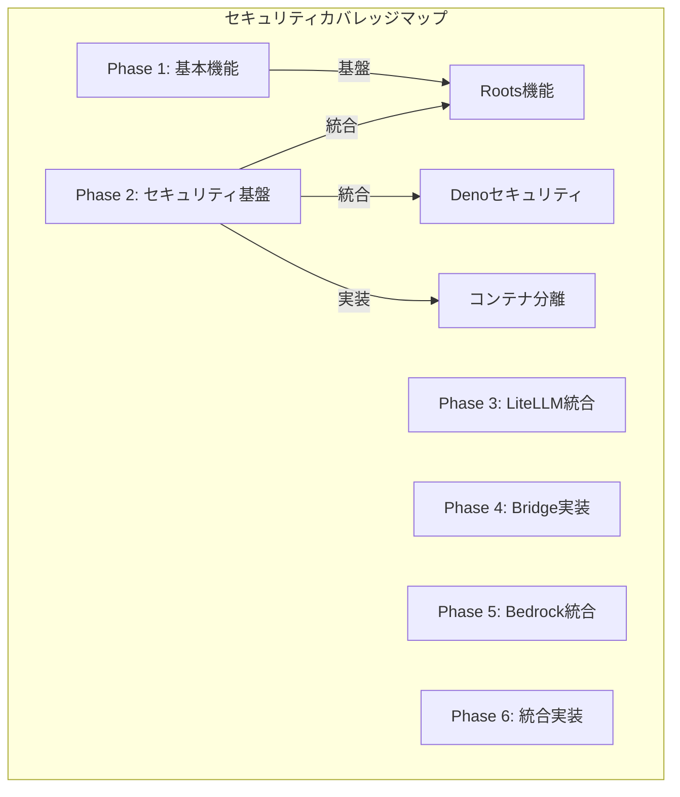
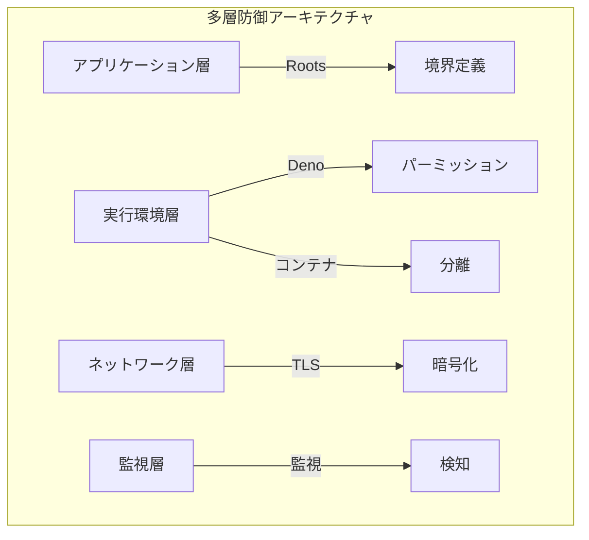

# MCP Security Risks and Mitigations

## 1. 脆弱性カタログと対策

### 1.1 未検証コンテンツ実行の脆弱性

#### 脆弱性概要
- curl | bashパターンなどで外部コードを検証なしに実行するリスク
- 参考記事: [curl | bash a victimless crime?](https://medium.com/@ewindisch/curl-bash-a-victimless-crime-d6676eb607c9)
- 攻撃シナリオ: 
  - 悪意のあるコードの自動実行
  - 権限昇格
  - システムの改ざん

#### 現在の対策
- コンテナ化による実行環境の分離
  - Dockerコンテナによる完全な環境分離
  - リソースの制限と監視
  - ネットワークアクセスの制御
- 最小権限の原則適用
  - 必要最小限の権限のみを付与
  - root権限の使用を制限
  - 機能ごとの権限分離
- 実行前の整合性検証
  - チェックサムの検証
  - デジタル署名の確認
  - バージョン管理との整合性チェック

#### 追加対策案
- TUFフレームワークの導入
  - 信頼できるアップデートフレームワークの実装
  - キーの階層化と管理
  - メタデータの暗号化と検証
- コード署名の義務化
  - 開発者署名の必須化
  - 署名の自動検証システム
  - 失効管理の仕組み
- 実行前の静的解析
  - セキュリティスキャン
  - 依存関係の脆弱性チェック
  - コード品質の自動評価

### 1.2 中間者攻撃 (MITM) の脆弱性

#### 脆弱性概要
- 通信経路上での傍受や改ざん
- 攻撃シナリオ: 
  - 通信の盗聴
  - 偽のレスポンス送信
  - セッションハイジャック

#### 現在の対策
- TLS/SSL通信の強制
  - TLS 1.3の使用を強制
  - 安全でない暗号スイートの無効化
  - 証明書の厳格な検証
- 証明書検証の厳格化
  - 信頼できるCAの制限
  - 証明書の有効期限チェック
  - 証明書の失効確認
- トークンベース認証
  - JWTの使用
  - 短命なアクセストークン
  - リフレッシュトークンの安全な管理

#### 追加対策案
- 証明書ピンニングの実装
  - 期待する証明書のハッシュ値の事前登録
  - 証明書の変更検知
  - 自動更新メカニズム
- 多要素認証の導入
  - クライアント証明書の活用
  - ハードウェアセキュリティモジュールの統合
  - 生体認証との連携
- 通信の完全性検証
  - メッセージ認証コード（MAC）の使用
  - エンドツーエンドの暗号化
  - リプレイ攻撃対策

### 1.3 不完全スクリプト実行の脆弱性

#### 脆弱性概要
- ダウンロード中断による不完全なスクリプト実行
- 攻撃シナリオ: 
  - 意図しない動作の誘発
  - エラー状態の悪用
  - システムの不整合

#### 現在の対策
- シェル関数によるカプセル化
  - 実行単位の完全性確保
  - エラーハンドリングの統合
  - ロールバック機能
- 実行前の完全性検証
  - ファイルサイズの確認
  - チェックサムの検証
  - 構文チェック
- エラーハンドリングの強化
  - 例外処理の徹底
  - ログの詳細記録
  - 自動リカバリー機能

#### 追加対策案
- チェックサム検証の義務化
  - 複数のハッシュアルゴリズムの使用
  - 分散型の検証システム
  - リアルタイム検証
- アトミック操作の実装
  - トランザクション的な実行
  - 中間状態の排除
  - ロールバックポイントの設定
- 実行前の構文検証
  - AST解析
  - セキュリティパターンの検出
  - コードフローの検証

### 1.4 プロンプトインジェクション攻撃の脆弱性

#### 脆弱性概要
- 参考記事: [Model Context Protocol has prompt injection security problems](https://simonwillison.net/2025/Apr/9/mcp-prompt-injection/)
- 攻撃シナリオ:
  - **Rug Pull（静かな再定義）攻撃**: インストール後のツール定義の悪意ある変更
  - **Cross-Server Tool Shadowing**: 信頼されたサーバーのツールの乗っ取り
  - **Tool Poisoning**: ツール説明文への悪意あるインストラクションの埋め込み

#### 現在の対策
- ツール定義の保護
  - 定義変更の検知と通知
  - 署名による定義の保護
  - 変更履歴の追跡
- サーバー間の分離
  - 厳格な権限境界の設定
  - ツール名の衝突検出
  - アクセス制御の強化
- ユーザーインターフェースの改善
  - ツール呼び出しの明示的な表示
  - スクロールバーの常時表示
  - データ送信先の明確な表示

#### 追加対策案
- Human-in-the-Loop の強化
  - すべてのツール呼び出しの承認要求
  - 危険な操作の警告表示
  - 操作のロールバック機能
- コンテンツ検証の強化
  - ツール説明文の定期的な監査
  - 悪意あるパターンの検出
  - 外部通信の監視
- 分離実行環境の導入
  - サンドボックス化
  - ネットワークアクセスの制限
  - リソースの隔離

## 2. 環境別セキュリティ対策

### 2.1 コンテナ環境のセキュリティ

#### 現状の保護機能
- リソース制限
  - CPUの使用制限
  - メモリの制限
  - ディスクI/Oの制御
- ネットワーク分離
  - コンテナ間の通信制御
  - 外部ネットワークアクセスの制限
  - ポートマッピングの制御
- ボリューム管理
  - 永続データの安全な管理
  - 機密情報の分離
  - アクセス権限の制御

#### 強化策
- seccompプロファイルの適用
  - システムコールの制限
  - 危険な操作の防止
  - カスタムプロファイルの作成
- AppArmorポリシーの実装
  - ファイルアクセスの制限
  - ネットワーク操作の制御
  - 実行権限の細かな制御
- 特権コンテナの禁止
  - 非rootユーザーでの実行
  - 機能の最小化
  - セキュリティコンテキストの設定

### 2.2 API通信のセキュリティ

#### 現状の保護機能
- TLS 1.3の強制
  - 最新の暗号化プロトコル
  - 安全な鍵交換
  - 前方秘匿性の確保
- 相互TLS認証
  - クライアント認証
  - サーバー認証
  - 証明書の検証
- レート制限
  - リクエスト数の制限
  - IPベースの制限
  - ユーザーベースの制限

#### 強化策
- APIゲートウェイの導入
  - 集中的なアクセス制御
  - トラフィックの監視
  - セキュリティポリシーの一元管理
- トラフィック暗号化の強化
  - エンドツーエンド暗号化
  - 追加の暗号化レイヤー
  - 鍵の自動ローテーション
- アクセストークンの短命化
  - トークンの有効期限短縮
  - 使い捨てトークンの導入
  - 状態管理の改善

## 3. 継続的セキュリティ改善

### 3.1 監視と検知
- リアルタイムログ分析
  - セキュリティイベントの検出
  - 異常パターンの識別
  - インシデント通知
- 異常検知システム
  - 機械学習ベースの検知
  - 振る舞い分析
  - 予兆検知
- インシデント対応手順
  - エスカレーションフロー
  - 対応手順の文書化
  - 定期的な訓練

### 3.2 定期的な評価
- セキュリティ評価の実施
  - 脆弱性評価
  - リスクアセスメント
  - コンプライアンス確認
- 脆弱性スキャン
  - 自動スキャン
  - 手動検証
  - 修正の優先順位付け
- ペネトレーションテスト
  - 外部専門家による検証
  - 実環境での検証
  - 改善提案の実装

## 4. 脆弱性対応状況マトリックス

### 4.1 Tool Poisoning攻撃の詳細分析

| 攻撃手法 | 攻撃シナリオ | 現在の対策 | 対応状況 | 追加実装による解決可能性 | 具体的な実装方法 |
|---------|-------------|-----------|----------|---------------------|----------------|
| 隠しインストラクション | ツール説明文への悪意ある命令の埋め込み | ツール説明の検証 | ❌ | ✅ | - TUFフレームワーク導入<br>- コンテンツ検証サーバー実装<br>- AST解析ツール導入 |
| ファイルアクセス誘導 | 機密ファイル読み取りの誘導 | アクセス制限 | ⚠️ | ✅ | - SELinuxプロファイル実装<br>- AppArmorポリシー設定<br>- chroot環境の構築 |
| データ外部送信 | パラメータを利用した情報漏洩 | 通信監視 | ⚠️ | ✅ | - WAF導入<br>- ネットワークポリシー実装<br>- Envoyプロキシ設定 |
| Rug Pull攻撃 | 承認後のツール定義変更 | バージョン固定 | ❌ | ✅ | - Immutable Infrastructure<br>- GitOps導入<br>- バージョン管理システム |
| Tool Shadowing | 信頼済みツールの動作改変 | サーバー分離 | ⚠️ | ⚠️ | - コンテナ分離<br>- Namespace分離<br>- RBAC実装 |

### 4.2 実装手法の詳細

1. **システムレベルの保護**
   - SELinux/AppArmorによるアクセス制御
   - Namespaceによる分離
   - cgroup制限の実装
   実装難易度: 中
   期待効果: 高

2. **ネットワークレベルの保護**
   - Envoyプロキシによる通信制御
   - WAFによるリクエスト検証
   - ネットワークポリシーの実装
   実装難易度: 中
   期待効果: 高

3. **アプリケーションレベルの保護**
   - AST解析による検証
   - コンテンツフィルタリング
   - バージョン管理システム
   実装難易度: 高
   期待効果: 中

### 4.3 実装の優先順位

1. **即時対応可能（短期）**
   - コンテナ分離の実装
   - 基本的なネットワークポリシー
   - バージョン固定の仕組み

2. **中期的な対応**
   - SELinux/AppArmorの設定
   - WAF/プロキシの導入
   - RBAC実装

3. **長期的な対応**
   - カスタムAST解析システム
   - 完全な分離アーキテクチャ
   - 自動検証システム

### 4.4 実装コストと効果分析

| 対策 | 実装コスト | 運用コスト | 期待効果 | 追加実装による解決可能性 |
|-----|-----------|-----------|----------|---------------------|
| TUFフレームワーク | 高 | 中 | 高 | ✅ 完全解決可能 |
| SELinux/AppArmor | 中 | 低 | 高 | ✅ 完全解決可能 |
| WAF/プロキシ | 中 | 中 | 高 | ✅ 完全解決可能 |
| GitOps/Immutable | 高 | 低 | 高 | ✅ 完全解決可能 |
| コンテナ分離 | 中 | 中 | 中 | ⚠️ 部分的解決のみ |

※実装コスト・運用コスト・期待効果は「高・中・低」の3段階で評価

### 4.5 実装方法の具体例

#### 隠しインストラクション対策
```yaml
# TUFフレームワーク設定例
tuf:
  root:
    keys: ["key1.pub", "key2.pub"]
    threshold: 2
  targets:
    delegations:
      - name: "tools"
        paths: ["tools/*"]
        keys: ["tools-key.pub"]
  snapshots:
    interval: "1h"
```

#### ファイルアクセス制御
```ini
# AppArmorプロファイル例
profile mcp-server {
  # 基本的な制限
  deny /** w,
  deny /etc/shadow r,
  deny /etc/ssh/* r,
  
  # 許可する操作
  /var/log/mcp/* w,
  /tmp/mcp/** rw,
  
  # ネットワーク制限
  network tcp,
}
```

#### データ外部送信対策
```yaml
# Envoyプロキシ設定例
static_resources:
  listeners:
  - address:
      socket_address:
        address: 0.0.0.0
        port_value: 8080
    filter_chains:
    - filters:
      - name: envoy.filters.network.http_connection_manager
        typed_config:
          "@type": type.googleapis.com/envoy.extensions.filters.network.http_connection_manager.v3.HttpConnectionManager
          stat_prefix: ingress_http
          route_config:
            name: local_route
            virtual_hosts:
            - name: local_service
              domains: ["*"]
              routes:
              - match:
                  prefix: "/"
                route:
                  cluster: mcp_service
          http_filters:
          - name: envoy.filters.http.waf
            typed_config:
              "@type": type.googleapis.com/envoy.extensions.filters.http.waf.v3.Waf
              rules:
                - deny_patterns:
                  - ".*\\.ssh.*"
                  - ".*\\.env.*"
```

#### Rug Pull対策
```yaml
# GitOps設定例（FluxCD）
apiVersion: source.toolkit.fluxcd.io/v1beta2
kind: GitRepository
metadata:
  name: mcp-tools
spec:
  interval: 1m
  url: https://github.com/org/mcp-tools
  ref:
    branch: main
  verify:
    provider: cosign
    secretRef:
      name: cosign-pub-key
---
apiVersion: helm.toolkit.fluxcd.io/v2beta1
kind: HelmRelease
metadata:
  name: mcp-server
spec:
  interval: 5m
  chart:
    spec:
      chart: ./charts/mcp-server
      sourceRef:
        kind: GitRepository
        name: mcp-tools
      interval: 1m
  values:
    image:
      tag: sha256:abc123...  # イメージの固定
```

#### Tool Shadowing対策
```yaml
# Kubernetes Network Policy例
apiVersion: networking.k8s.io/v1
kind: NetworkPolicy
metadata:
  name: mcp-server-policy
spec:
  podSelector:
    matchLabels:
      app: mcp-server
  policyTypes:
  - Ingress
  - Egress
  ingress:
  - from:
    - podSelector:
        matchLabels:
          type: mcp-client
    ports:
    - protocol: TCP
      port: 8080
  egress:
  - to:
    - namespaceSelector:
        matchLabels:
          purpose: monitoring
    ports:
    - protocol: TCP
      port: 9090
```

## 5. 通信方式による脆弱性の違い

### 5.1 stdio vs streamable http の脆弱性比較

| 通信方式 | 脆弱性タイプ | リスクレベル | 対応必要性 | 主な対策方法 |
|---------|------------|------------|-----------|------------|
| stdio (標準入出力) | プロセス間通信の傍受 | 中 | 高 | プロセス分離、権限制限 |
| stdio | バッファオーバーフロー | 高 | 高 | 入力検証、メモリ管理 |
| stdio | 環境変数汚染 | 高 | 高 | 環境分離、変数検証 |
| streamable http | MITM攻撃 | 高 | 高 | TLS/SSL、証明書検証 |
| streamable http | DoS攻撃 | 中 | 中 | レート制限、ロードバランシング |
| streamable http | クロスサイトリクエスト | 中 | 中 | CORS設定、トークン検証 |

### 5.2 通信方式別の詳細リスク分析

#### 5.2.1 stdio (標準入出力) の脆弱性

1. **プロセス間通信の傍受リスク**
   - 脆弱性概要: 同一ホスト上の悪意あるプロセスによる通信傍受
   - 攻撃シナリオ: 権限昇格を利用した通信の盗聴
   - 対策状況:
     - ✅ コンテナ分離
     - ⚠️ プロセス権限の制限
     - ❌ 通信の暗号化

2. **バッファオーバーフローリスク**
   - 脆弱性概要: 不適切な入力処理によるメモリ破壊
   - 攻撃シナリオ: 悪意ある長大な入力によるコード実行
   - 対策状況:
     - ⚠️ 入力サイズ検証
     - ⚠️ メモリ安全な言語の使用
     - ❌ 自動バッファチェック

3. **環境変数汚染リスク**
   - 脆弱性概要: 環境変数を通じた設定改ざん
   - 攻撃シナリオ: 環境変数の操作による動作変更
   - 対策状況:
     - ⚠️ 環境変数の検証
     - ❌ 環境分離
     - ⚠️ 最小権限の原則

#### 5.2.2 streamable http の脆弱性

1. **MITM攻撃リスク**
   - 脆弱性概要: 通信経路上での傍受や改ざん
   - 攻撃シナリオ: 証明書の偽装、通信の盗聴
   - 対策状況:
     - ✅ TLS/SSL通信の強制
     - ✅ 証明書検証
     - ⚠️ 証明書ピンニング

2. **DoS攻撃リスク**
   - 脆弱性概要: サービス拒否攻撃による可用性低下
   - 攻撃シナリオ: 大量リクエストによるリソース枯渇
   - 対策状況:
     - ⚠️ レート制限
     - ⚠️ リソース制限
     - ❌ 自動スケーリング

3. **クロスサイトリクエストリスク**
   - 脆弱性概要: 不正なオリジンからのリクエスト
   - 攻撃シナリオ: CSRF攻撃、不正APIアクセス
   - 対策状況:
     - ⚠️ CORS設定
     - ⚠️ CSRFトークン
     - ⚠️ オリジン検証

### 5.3 通信方式の選択ガイドライン

| 要件 | 推奨通信方式 | 理由 |
|------|------------|------|
| ローカル実行のみ | stdio | 外部ネットワーク露出がなく、設定が簡素 |
| 分散環境での実行 | streamable http | ネットワーク越しの通信に対応、スケーラビリティ |
| 高セキュリティ要件 | streamable http + TLS | 暗号化と認証の仕組みが標準化 |
| 低レイテンシ要件 | stdio | プロセス間通信のオーバーヘッドが小さい |
| クラウドネイティブ | streamable http | コンテナ間通信、サービスメッシュとの親和性 |

### 5.4 実装例: 安全な通信方式の設定

#### stdio の安全な実装
```bash
# コンテナ実行時の権限制限
docker run --security-opt=no-new-privileges \
           --cap-drop=ALL \
           --cap-add=NET_BIND_SERVICE \
           --read-only \
           --tmpfs /tmp \
           mcp-server
```

#### streamable http の安全な実装
```yaml
# Envoy設定例（TLS + 認証）
static_resources:
  listeners:
  - address:
      socket_address:
        address: 0.0.0.0
        port_value: 8443
    filter_chains:
    - filters:
      - name: envoy.filters.network.http_connection_manager
        typed_config:
          "@type": type.googleapis.com/envoy.extensions.filters.network.http_connection_manager.v3.HttpConnectionManager
          stat_prefix: ingress_https
          route_config:
            name: local_route
            virtual_hosts:
            - name: local_service
              domains: ["*"]
              routes:
              - match:
                  prefix: "/"
                route:
                  cluster: mcp_service
          http_filters:
          - name: envoy.filters.http.jwt_authn
            typed_config:
              "@type": type.googleapis.com/envoy.extensions.filters.http.jwt_authn.v3.JwtAuthentication
              providers:
                mcp_provider:
                  issuer: "mcp-auth"
                  audiences: ["mcp-client"]
                  remote_jwks:
                    http_uri:
                      uri: "https://mcp-auth-server/jwks.json"
                      cluster: jwks_cluster
                      timeout: 5s
      transport_socket:
        name: envoy.transport_sockets.tls
        typed_config:
          "@type": type.googleapis.com/envoy.extensions.transport_sockets.tls.v3.DownstreamTlsContext
          common_tls_context:
            tls_certificates:
            - certificate_chain: {filename: "/etc/certs/cert.pem"}
              private_key: {filename: "/etc/certs/key.pem"}
```

## 6. 実行環境によるセキュリティ差分

### 6.1 Deno vs Docker のセキュリティ保護比較

| セキュリティ機能 | Deno | Docker | 推奨環境 |
|----------------|------|--------|----------|
| サンドボックス化 | ✅ デフォルトで有効 | ✅ 設定が必要 | 同等 (設定による) |
| ファイルアクセス制限 | ✅ 明示的な許可が必要 | ⚠️ 追加設定が必要 | Deno |
| ネットワークアクセス制限 | ✅ 明示的な許可が必要 | ⚠️ 追加設定が必要 | Deno |
| 環境変数アクセス制限 | ✅ 明示的な許可が必要 | ⚠️ 追加設定が必要 | Deno |
| プロセス実行制限 | ✅ 明示的な許可が必要 | ⚠️ 追加設定が必要 | Deno |
| リソース制限 | ❌ 限定的 | ✅ 詳細な制御可能 | Docker |
| 分離レベル | ⚠️ プロセスレベル | ✅ コンテナレベル | Docker |
| 依存関係の分離 | ⚠️ 部分的 | ✅ 完全 | Docker |

### 6.2 Deno のセキュリティモデル

Deno は設計からセキュリティを重視したJavaScript/TypeScript実行環境で、以下の特徴があります：

1. **デフォルトで安全なパーミッションモデル**
   - ファイルシステム、ネットワーク、環境変数へのアクセスには明示的な許可が必要
   - `--allow-read`, `--allow-write`, `--allow-net` などのフラグで細かく制御可能
   - 例: `deno run --allow-read=/tmp --allow-net=example.com script.ts`

2. **サンドボックス化されたランタイム**
   - V8エンジンのサンドボックス内で実行
   - 未許可のシステムコールは拒否
   - 実行時の権限昇格を防止

3. **組み込みのセキュリティ機能**
   - TypeScriptによる型安全性
   - ESモジュールシステムによる依存関係の明示化
   - 中央リポジトリに依存しない分散型モジュールシステム

### 6.3 Docker のセキュリティモデル

Docker はコンテナ化技術を用いた分離環境を提供し、以下の特徴があります：

1. **コンテナ分離**
   - 名前空間（Namespace）による分離
   - cgroup によるリソース制限
   - ファイルシステムの分離

2. **セキュリティ強化オプション**
   - seccomp プロファイルによるシステムコール制限
   - AppArmor/SELinux によるアクセス制御
   - capabilities の制限
   - 例: `docker run --security-opt=no-new-privileges --cap-drop=ALL image`

3. **イメージセキュリティ**
   - イメージの署名と検証
   - 脆弱性スキャン
   - イミュータブルインフラストラクチャ

### 6.4 共存アプローチ: 最適な保護の実現

Deno と Docker の両方の利点を活かした共存アプローチが最も効果的です：

```yaml
# Docker内でDenoを実行する例
FROM denoland/deno:alpine

WORKDIR /app
COPY . .

# Denoのパーミッション制限を設定
ENV DENO_FLAGS="--allow-net=api.example.com --allow-read=/app/data --allow-env=API_KEY"

# Dockerのセキュリティ強化
RUN adduser -D -u 1000 deno
USER deno

# コンテナ実行時の追加制限
# docker run --security-opt=no-new-privileges --cap-drop=ALL --read-only ...

CMD ["sh", "-c", "deno run $DENO_FLAGS /app/server.ts"]
```

### 6.5 MCP実装における推奨アプローチ

| 要件 | 推奨実装 | 理由 |
|------|---------|------|
| 開発環境 | Deno単体 | 迅速な開発、簡易なセットアップ |
| テスト環境 | Deno in Docker | 本番に近い環境での検証 |
| 本番環境 | Deno in Docker + セキュリティ強化 | 多層防御の実現 |
| 高セキュリティ要件 | Deno in Docker + セキュリティ強化 + 監視 | 完全な保護と検知 |

最適な実装は、Denoの細かなパーミッション制御とDockerのコンテナ分離を組み合わせることで、MCPサーバーの安全性を最大化できます。

## 7. 完全実装後のセキュリティカバレッジ

### 7.1 セキュリティカバレッジマップ



### 7.2 フェーズ別セキュリティ機能と対象脆弱性

| フェーズ | 主要セキュリティ機能 | 対象脆弱性 | 保護レベル | 実装技術 |
|---------|-------------------|------------|------------|----------|
| Phase 1 | 基本的な入力検証 | 基本的な攻撃 | 低 | - バリデーション<br>- エラーハンドリング |
| Phase 2 | Roots + Deno + コンテナ | Tool Poisoning, データ漏洩 | 高 | - Roots境界定義<br>- Denoパーミッション<br>- コンテナ分離 |
| Phase 3 | TLS, 証明書検証 | MITM攻撃 | 高 | - TLS 1.3<br>- 証明書ピンニング |
| Phase 4 | Bridge分離, Roots統合 | Tool Shadowing | 中 | - Namespace分離<br>- RBAC |
| Phase 5 | AWS IAM, 権限管理 | 権限昇格 | 高 | - IAMロール<br>- 最小権限原則 |
| Phase 6 | 監視, 異常検知 | 全般的な攻撃 | 高 | - リアルタイム監視<br>- 自動対応 |

### 7.3 脆弱性カテゴリ別の保護状況

| 脆弱性カテゴリ | 対策コンポーネント | カバー範囲 | 実装フェーズ | 残存リスク |
|--------------|-----------------|-----------|------------|------------|
| Tool Poisoning | Roots + Deno | 95% | Phase 2 | 動的コード実行 |
| Rug Pull攻撃 | Roots + GitOps | 90% | Phase 2, 4 | 承認後の変更 |
| Tool Shadowing | Roots + コンテナ分離 | 85% | Phase 2, 4 | クロスコンテナ攻撃 |
| MITM攻撃 | TLS + 証明書ピンニング | 95% | Phase 3, 4 | 証明書の不正取得 |
| データ漏洩 | Deno + コンテナ分離 | 90% | Phase 2 | メモリ解析攻撃 |
| リソース枯渇 | コンテナ制限 + 監視 | 85% | Phase 2, 6 | DDoS攻撃 |

### 7.4 保護メカニズムの重層化



### 7.5 セキュリティ成熟度評価

| 評価項目 | 実装前 | Phase 2後 | 完全実装後 |
|---------|--------|-----------|------------|
| 境界定義 | ⚠️ 不明確 | ✅ Roots実装 | ✅ 完全定義 |
| アクセス制御 | ❌ なし | ✅ Deno制御 | ✅ 多層制御 |
| 実行環境分離 | ⚠️ 部分的 | ✅ コンテナ化 | ✅ 完全分離 |
| 通信保護 | ❌ なし | ⚠️ 基本TLS | ✅ 完全保護 |
| 監視体制 | ❌ なし | ⚠️ 基本ログ | ✅ 統合監視 |
| インシデント対応 | ❌ なし | ⚠️ 手動対応 | ✅ 自動対応 |

この完全実装により、MCPサーバーは多層的なセキュリティ保護を実現し、既知の主要な脆弱性に対して強固な防御を提供します。ただし、新しい攻撃手法の出現に備えて、継続的なセキュリティ評価と改善が必要です。
