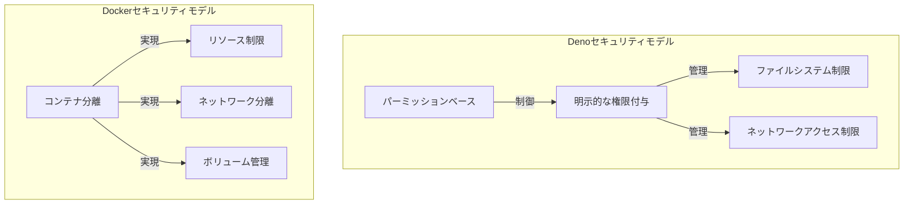
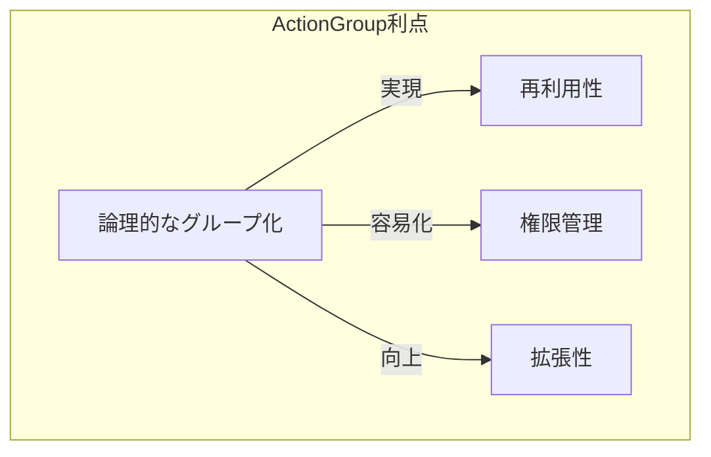
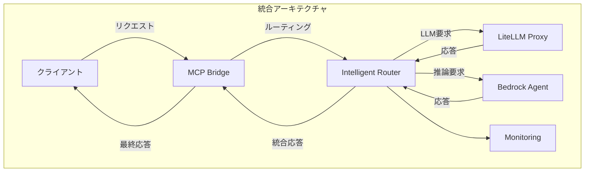
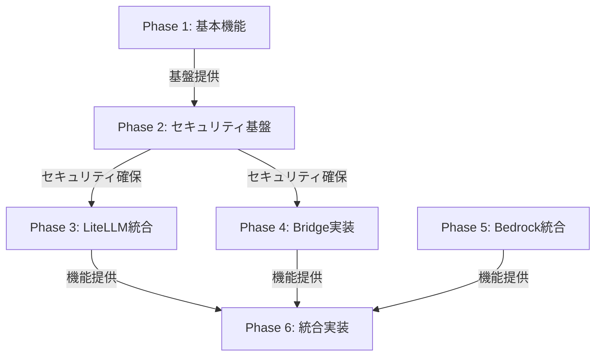
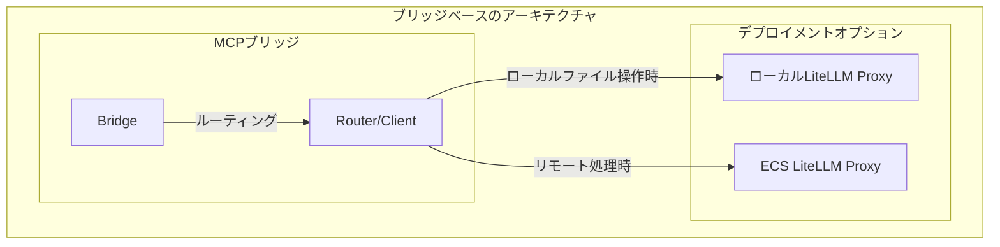
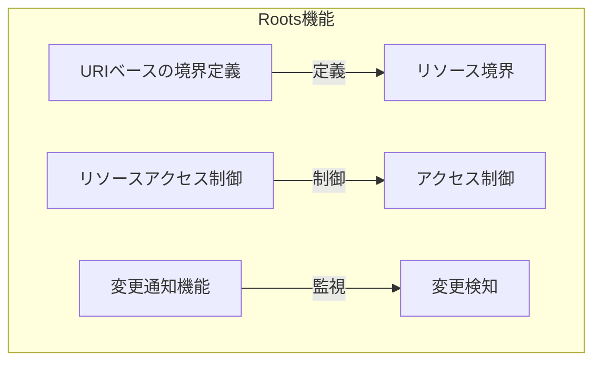
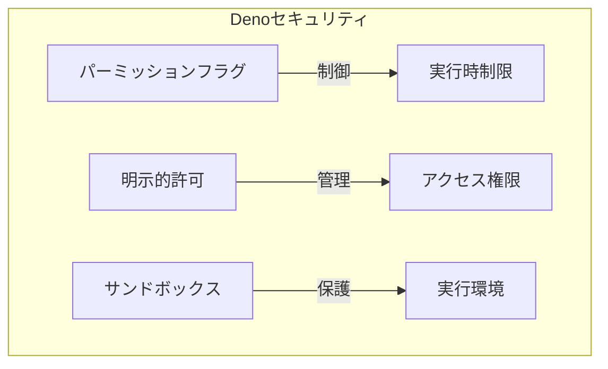
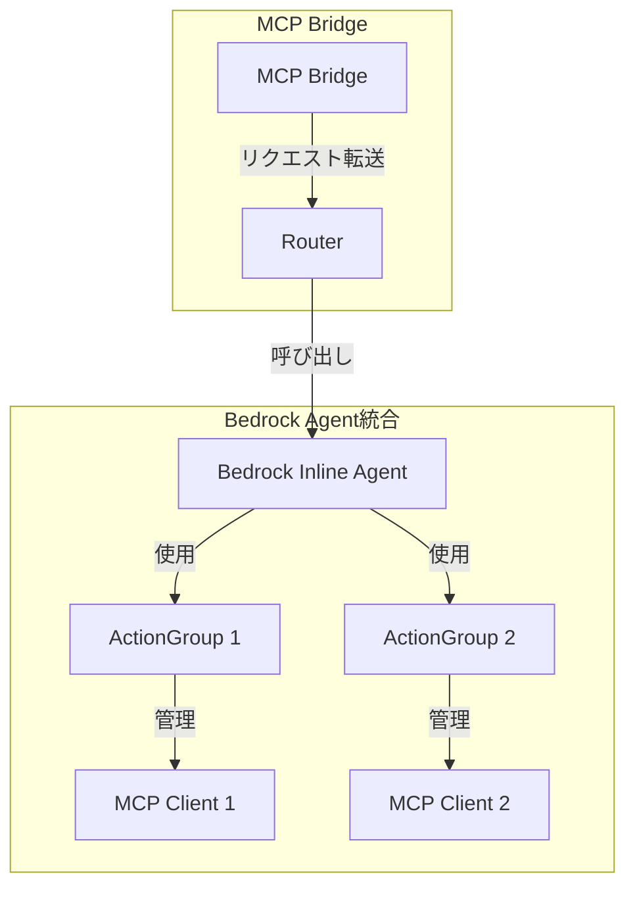

# MCP Implementation Specification

## 1. プロジェクト概要

### 1.1 目的
MCPサーバーの実装において、セキュアで柔軟な統合アプローチを実現する。特に、LiteLLM ProxyとAmazon Bedrock Agentsの機能を活用し、効率的なMCPサーバーの実装を目指す。

### 1.2 背景
- MCPサーバーの実装における複雑さと設定の煩雑さ
- セキュリティリスクへの対応必要性
- 異なる実行環境での一貫性確保の課題

## 2. 検討したアプローチ

### 2.0 セキュリティモデルの比較

#### DenoとDockerのセキュリティ特性比較


#### 選択理由
- Docker採用の主な理由：
  - 完全な環境分離が必要
  - 本番環境での実績が豊富
  - オーケストレーションツールとの親和性
  - リソース管理の柔軟性

- Deno不採用の理由：
  - システムレベルの完全な分離が困難
  - 本番環境での実績が限定的
  - 特定の言語環境に依存

### 2.1 Denoベースのアプローチ
#### 利点
- デフォルトで安全なパーミッションモデル
- 明示的な権限付与が必要
- ドメインごとのネットワークアクセス制限

#### 課題
- システムリソースの完全分離が困難
- 依存関係の完全分離ができない
- ホストOSへの直接アクセスのリスク

### 2.2 Dockerベースのアプローチ
#### 利点
- 完全な環境分離
- リソース使用量の制限
- ネットワークの完全な制御

#### 課題
- 細粒度の権限制御が難しい
- コンテナ内部の挙動制御が粗い
- 特定APIへのアクセス制限が複雑

### 2.3 LiteLLM Proxyの活用
#### 利点
- 既存の機能と統合が容易
- 安定性とセキュリティが検証済み
- アクティブなコミュニティサポート

#### 課題
- カスタマイズの制限
- 依存関係の管理

### 2.4 Bedrock Agentsの統合
#### 利点
- ActionGroupによる機能の論理的グループ化
- 高度な推論能力の活用
- AWSサービスとの緊密な統合

#### 課題
- AWS依存性の増加
- コスト面での考慮

## 3. 選定したアーキテクチャ

### 3.0 設計方針

#### ActionGroupパターンの採用理由


- **論理的な機能分割**
  - 関連する機能のカプセル化
  - 責務の明確な分離
  - メンテナンス性の向上

- **再利用性の向上**
  - 共通機能の集約
  - 異なるコンテキストでの再利用
  - 設定の共有化

- **柔軟な権限管理**
  - グループ単位でのアクセス制御
  - きめ細かな権限設定
  - セキュリティの強化

#### 段階的実装アプローチの選択理由
- リスクの最小化
- 早期のフィードバック獲得
- 要件の段階的な検証
- チーム全体の学習曲線の最適化

#### LiteLLM Proxy既存資産活用のメリット
- 実績のある実装の活用
- 開発工数の削減
- 信頼性の確保
- コミュニティサポートの活用
- 将来的な機能拡張の容易さ


### 3.1 全体アーキテクチャ



### 3.2 実装コンセプト

#### Phase 1: LiteLLM MCP基本実装
```python
class LiteLLMMCPServer:
    def __init__(self, config: Dict[str, Any]):
        self.proxy_url = config['proxy_url']
        self.auth_token = config['auth_token']
    
    async def list_tools(self) -> List[Dict[str, Any]]:
        """利用可能なツールのリスト取得"""
        response = await self._make_request('/mcp/tools/list')
        return response.get('tools', [])
    
    async def call_tool(self, name: str, arguments: Dict[str, Any]) -> Any:
        """ツールの呼び出し"""
        response = await self._make_request('/mcp/tools/call', {
            'name': name,
            'arguments': arguments
        })
        return response.get('result')
```

#### Phase 2: Bridge MCP実装
```python
class MCPBridge:
    def __init__(self):
        self.router = Router()
        self.providers: Dict[str, Provider] = {}
    
    async def handle_stdio(self):
        """stdioを通じたMCPリクエスト処理"""
        for line in sys.stdin:
            request = json.loads(line)
            response = await self.router.route(request)
            print(json.dumps(response))
            sys.stdout.flush()
```

#### Phase 3: Bedrock MCP実装
```python
class BedrockMCPProvider:
    def __init__(self, config: Dict[str, Any]):
        self.agent = InlineAgent(
            foundation_model=config['model'],
            instruction=config['instruction'],
            action_groups=[
                self._create_action_group(group)
                for group in config['action_groups']
            ]
        )
    
    def _create_action_group(self, config: Dict[str, Any]) -> ActionGroup:
        """ActionGroupの動的生成"""
        return ActionGroup(
            name=config['name'],
            mcp_clients=config.get('mcp_clients', [])
        )
```

#### Phase 4: Unified MCP実装
```python
class UnifiedMCPServer:
    def __init__(self, config_path: str):
        self.config = self._load_config(config_path)
        self.router = IntelligentRouter()
        self.monitor = MonitoringSystem()
    
    async def route_request(self, request: Dict[str, Any]) -> Dict[str, Any]:
        """インテリジェントルーティング"""
        provider = self.router.determine_provider(request)
        response = await provider.handle_request(request)
        await self.monitor.record_interaction(request, response)
        return response
```

### 3.3 実装フェーズ

#### Phase 1: 基本機能実装 (1.basic-mcp)
- 目的: 基本的なMCP機能の実装
- コンポーネント:
  - core/: 基本機能の実装
  - config/: 設定管理
  - tests/: テストコード
- 主要機能:
  - 基本的なMCPインターフェース
  - 設定管理システム
  - エラーハンドリング

#### Phase 2: セキュリティ基盤実装 (2.security-mcp)
- 目的: Deno実行環境とRoots機能の統合
- コンポーネント:
  - security/: セキュリティ機能
    - roots/: Roots機能実装
    - permissions/: Denoパーミッション管理
  - validators/: 入力検証
- 主要機能:
  - Roots機能の実装
    - URIベースの境界定義
    - 変更通知システム
    - アクセス制御
  - Denoセキュリティ統合
    - パーミッション管理
    - ファイルシステム制限
    - ネットワークアクセス制御

#### Phase 3: LiteLLM統合 (3.litellm-mcp)
- 目的: LiteLLM Proxyとの統合
- コンポーネント:
  - providers/litellm/: LiteLLM連携
  - adapters/: プロトコル変換
- 主要機能:
  - LiteLLM Proxy統合
  - セキュアな通信
  - モデル管理

#### Phase 4: Bridge実装 (4.bridge-mcp)
- 目的: MCPブリッジの実装
- コンポーネント:
  - bridge/: ブリッジ機能
    - client/: クライアント機能
    - server/: サーバー機能
  - router/: ルーティング
- 主要機能:
  - クライアント/サーバー機能
  - Roots対応ルーティング
  - プロトコル変換

#### Phase 5: Bedrock統合 (5.bedrock-mcp)
- 目的: Amazon Bedrock統合
- コンポーネント:
  - providers/bedrock/: Bedrock連携
  - actions/: ActionGroup実装
- 主要機能:
  - Bedrock Agents統合
  - ActionGroup実装
  - 推論機能

#### Phase 6: 統合実装 (6.unified-mcp)
- 目的: 完全な統合と監視
- コンポーネント:
  - gateway/: 統合ゲートウェイ
  - monitors/: 監視システム
  - analytics/: 分析機能
- 主要機能:
  - 完全な機能統合
  - 高度な監視
  - パフォーマンス分析

### 3.4 フェーズ間の依存関係



### 3.5 ブリッジベースのハイブリッドアプローチ



#### ブリッジベースのルーティング設定
```yaml
# ブリッジ設定例
routing:
  rules:
    - pattern: "file_operation"
      target: "http://localhost:8000"  # ローカルProxy
    - pattern: "default"
      target: "https://ecs-proxy.example.com"  # ECS Proxy
```

#### セキュリティ考慮点

| 機能 | リモートProxy | ローカルProxy | セキュリティ影響 |
|-----|-------------|--------------|--------------|
| ファイルアクセス | 不可 | 可能 | 限定的（コンテナ内） |
| 認証 | IAM | API Key | 影響小（ローカルのみ） |
| 監視 | 完全 | 限定的 | 一部制限あり |
| 分離 | VPC | コンテナ | コンテナ内に限定 |

このアプローチにより、以下の利点が得られます：
- 既存のブリッジ機能を活用した統一的なインターフェース
- 用途に応じた柔軟なProxy切り替え
- セキュリティ影響を最小限に抑えたローカルファイルアクセス
- コンテナ化による実行環境の分離

### 3.6 各フェーズの実装順序の根拠

1. **基本機能から開始**
   - 核となる機能の確立
   - テスト基盤の整備
   - 以降のフェーズの基礎確立

2. **早期のセキュリティ実装**
   - DenoとRootsによる強固な基盤
   - セキュリティリスクの早期対応
   - 後続フェーズでの安全性確保

3. **段階的な機能追加**
   - 各フェーズでの機能検証
   - リスクの最小化
   - フィードバックの反映

4. **最終統合**
   - 全機能の統合
   - 包括的な監視の実現
   - パフォーマンスの最適化

### 3.4 アーキテクチャの特徴
- モジュール性: 独立したコンポーネントの組み合わせ
- 拡張性: 新しいプロバイダーやツールの追加が容易
- セキュリティ: 多層防御アプローチ
- 柔軟性: 異なる実行環境への対応

## 4. セキュリティ考慮事項

### 4.0 Roots機能とDenoセキュリティモデルの統合

#### Roots機能の概要


Roots機能は、MCPクライアントがサーバーに対して関連リソースの場所と境界を伝えるための仕組みです。
主な特徴は以下の通りです：

1. **URIベースの境界定義**
   - ファイルシステムパスやHTTP URLを指定可能
   - 明示的なリソース境界の設定
   - 論理的な分離の実現

2. **リソースアクセス制御**
   - 許可されたリソースの明示
   - 不正アクセスの防止
   - セキュリティ境界の確立

3. **変更通知機能**
   - リソース変更の検知
   - 動的な境界の更新
   - 不正な変更の監視

#### Denoセキュリティモデルの活用


Denoのセキュリティモデルは、以下の特徴を持ちます：

1. **明示的なパーミッション管理**
   - `--allow-read`: 読み取り権限の制御
   - `--allow-write`: 書き込み権限の制御
   - `--allow-net`: ネットワークアクセスの制御
   - `--allow-env`: 環境変数アクセスの制御

2. **サンドボックス化された実行環境**
   - V8エンジンのサンドボックス内での実行
   - 未許可のシステムコールの拒否
   - 権限昇格の防止

#### 統合アプローチ
```yaml
# Roots + Deno統合設定例
roots:
  - uri: "file:///app/trusted"
    name: "信頼済みツール格納場所"
    permissions:
      deno:
        allow-read: true
        allow-write: false
  
  - uri: "https://api.example.com"
    name: "検証済みAPIエンドポイント"
    permissions:
      deno:
        allow-net: "api.example.com"
```

この統合により、以下のセキュリティ強化が実現できます：

1. **多層防御**
   - Rootsによる論理的な境界設定
   - Denoによる物理的なアクセス制限
   - 両方の機能による相互補完

2. **きめ細かなアクセス制御**
   - リソースごとの権限設定
   - 最小権限の原則の実践
   - 不正アクセスの防止

3. **変更検知と対応**
   - リソース変更の監視
   - 不正な変更の検知
   - 動的な権限調整

### 4.1 保護される脆弱性

#### 通信セキュリティ
- 中間者攻撃
- 通信の傍受
- 認証情報の漏洩

#### アクセス制御
- 不正なツールアクセス
- 権限昇格
- リソースの不正利用

#### データセキュリティ
- 機密情報の漏洩
- データの改ざん
- 不正なデータアクセス

#### 実行環境セキュリティ
- コンテナエスケープ
- リソース枯渇攻撃
- 設定の誤用

### 4.2 セキュリティ対策

#### 多層防御アプローチ
1. コンテナレベル
   - リソース制限
   - ネットワーク分離
   - 実行環境の隔離

2. アプリケーションレベル
   - 入力検証
   - アクセス制御
   - エラー処理

3. 通信レベル
   - TLS/SSL暗号化
   - 証明書検証
   - トークン認証

#### 監視と検出
- ログ監視
- 異常検知
- インシデント対応

## 5. 技術仕様

### 5.1 APIインターフェース
```typescript
interface MCPRequest {
  jsonrpc: "2.0";
  method: string;
  params?: any;
  id: string | number;
}

interface MCPResponse {
  jsonrpc: "2.0";
  result?: any;
  error?: {
    code: number;
    message: string;
    data?: any;
  };
  id: string | number;
}
```

### 5.2 設定ファイル形式
```yaml
# 基本設定
server:
  type: "bridge" | "bedrock" | "unified"
  port: number
  host: string

# セキュリティ設定
security:
  tls:
    enabled: boolean
    cert: string
    key: string
  authentication:
    type: "token" | "aws" | "none"
    config: object

# プロバイダー設定
providers:
  - name: string
    type: "litellm" | "bedrock" | "custom"
    config: object

# ルーティング設定
routing:
  rules:
    - pattern: string
      provider: string
      config: object
```

### 5.3 エラー処理
- 標準エラーコード
- エラーの階層化
- 詳細なエラーメッセージ
- リカバリーメカニズム

## 6. 開発ガイドライン

### 6.1 コーディング規約
- TypeScript/Python標準に準拠
- エラー処理の統一
- ログ出力の標準化
- テストカバレッジの確保

### 6.2 ドキュメント要件
- APIドキュメント
- 設定ガイド
- デプロイメントガイド
- トラブルシューティングガイド

### 6.3 テスト要件
- ユニットテスト
- 統合テスト
- セキュリティテスト
- パフォーマンステスト

## 7. Bedrock Agentsとの統合

### 7.1 Bedrock Inline Agentの活用


#### 主要コンポーネント
- **InlineAgent**: 動的にエージェントを構成
- **ActionGroup**: 関連機能のグループ化
- **MCPクライアント**: 外部MCPサーバーとの通信

#### 統合のメリット
- 高度な推論能力の活用
- 複数のMCPサーバーの統合
- 柔軟な設定と拡張

### 7.2 ハイブリッドアプローチ
- LiteLLM Proxyの既存機能活用
- Bedrock Agentsの推論能力活用
- 段階的な移行と拡張
- 最適なルーティングによる効率化

## 8. 重要な注意事項

### 8.1 LiteLLM Proxy MCPの機能確認
- 実装時には必ず [LiteLLM Proxy MCP公式ドキュメント](https://docs.litellm.ai/docs/mcp) を参照
- 以下の機能の最新仕様を確認：
  - `/mcp/tools/list` エンドポイント
  - `/mcp/tools/call` エンドポイント
  - MCP設定のYAML形式
  - ツール定義の形式
  - エラーハンドリングの仕様
- 実装前に必ずサンプルコードの動作確認
- バージョンアップに伴う仕様変更の確認
- 互換性の確認

## 9. 運用考慮事項

### 9.1 デプロイメント
- コンテナ化
- 設定管理
- スケーリング
- バックアップ

### 9.2 監視
- メトリクス収集
- ログ集約
- アラート設定
- パフォーマンス監視

### 9.3 メンテナンス
- アップデート手順
- バックアップ/リストア
- トラブルシューティング
- キャパシティプランニング
