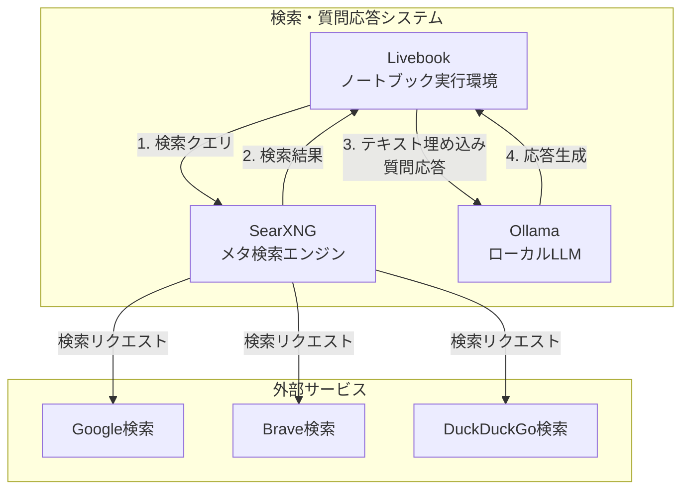
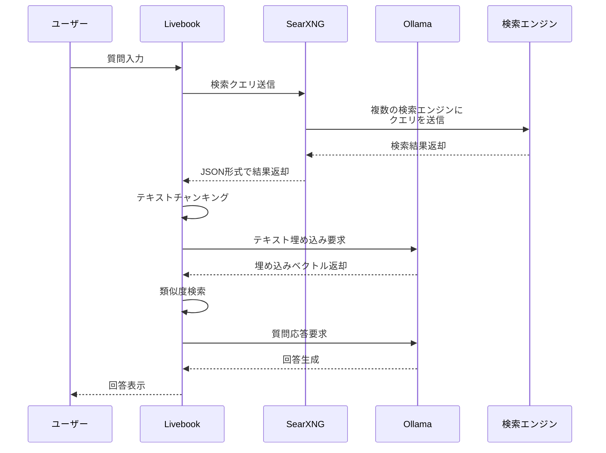
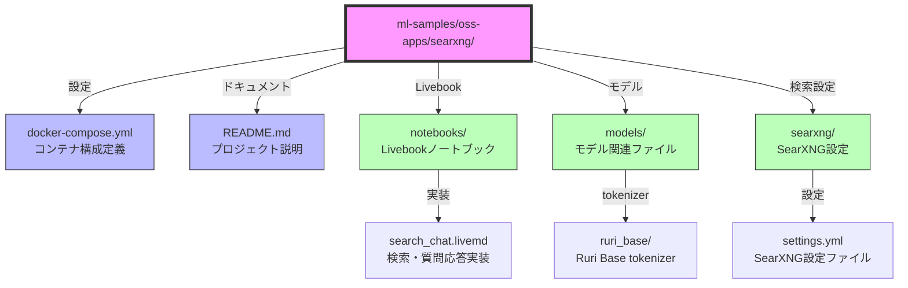

# SearXNG と Livebook による検索アプリケーション

このプロジェクトは、SearXNG検索エンジン、Livebook、Ollamaを組み合わせて、ウェブ検索とLLMを統合したアプリケーションを構築します。

## システムアーキテクチャ



## データフロー



## システム構成の詳細

### コンポーネントの役割

1. **Livebook**
   - 対話型Elixir開発環境
   - 検索処理のオーケストレーション
   - テキストチャンキングと埋め込み処理
   - 類似度検索による関連情報抽出
   - ユーザーインターフェース提供

2. **SearXNG**
   - プライバシー重視のメタ検索エンジン
   - 複数の検索エンジンの結果を統合
   - JSON形式でのレスポンス提供
   - 検索結果のランキングとフィルタリング

3. **Ollama**
   - ローカルLLMサーバー
   - テキスト埋め込みベクトルの生成
   - 質問応答機能の提供
   - 高速なモデル推論

### ディレクトリ構造の説明



### 処理フローの説明

1. **検索フェーズ**
   - ユーザーの質問をSearXNGに送信
   - 複数の検索エンジンから結果を取得
   - JSON形式で結果を受け取り

2. **テキスト処理フェーズ**
   - 検索結果からウェブサイトの内容を取得
   - HTMLタグの除去とテキストクリーニング
   - Chunxによるセマンティックチャンキング

3. **埋め込みフェーズ**
   - Ollamaを使用してテキストの埋め込みベクトルを生成
   - HNSWLibによるベクトルインデックスの作成
   - 質問文の埋め込みベクトル生成

4. **質問応答フェーズ**
   - 類似度検索による関連情報の抽出
   - コンテキスト情報の生成
   - Gemma 2による回答の生成

## 環境構成

以下のコンポーネントを Docker コンテナとして実行します：

- SearXNG: メタ検索エンジン
- Livebook: 対話型 Elixir 開発環境
- Ollama: ローカル LLM サーバー

### ディレクトリ構造

```
ml-samples/oss-apps/searxng/
├── docker-compose.yml
├── README.md
├── notebooks/          # Livebook ノートブック
│   └── search_chat.livemd
├── models/            # モデル関連ファイル
│   └── ruri_base/    # Ruri Base モデルの tokenizer
└── searxng/          # SearXNG の設定ファイル
    └── settings.yml
```

## セットアップ手順

1. リポジトリをクローンし、プロジェクトディレクトリに移動します：

```bash
cd ml-samples/oss-apps/searxng
```

2. 必要なディレクトリを作成します：

```bash
mkdir -p searxng models/ruri_base notebooks
```

3. Ruri Base モデルの tokenizer をダウンロードします：

```bash
curl -o models/ruri_base/tokenizer.json https://huggingface.co/ku-nlp/deberta-v2-base-japanese/raw/main/tokenizer.json
```

4. SearXNGの設定ファイルを作成します：

```bash
cat > searxng/settings.yml << 'EOL'
use_default_settings: false
server:
  secret_key: "searxng_secret_key"
  bind_address: "0.0.0.0"
  port: 8080
  base_url: "http://searxng_host:8080/"
  image_proxy: false
  cors_alloworigin: "*"
  public_instance: true
  limiter: false
  http_protocol_version: "1.0"

search:
  safe_search: 0
  autocomplete: 'google'
  default_lang: 'ja'

ui:
  query_in_title: false

general:
  debug: true
  instance_name: "SearXNG"

engines:
  - name: google
    use_mobile_ui: false
    disabled: false
  - name: duckduckgo
    disabled: false
  - name: brave
    disabled: false

outgoing:
  request_timeout: 5.0
  max_request_timeout: 15.0

result_proxy:
  url: ""
  key: ""

formats:
  - html
  - json
EOL
```

5. docker-compose.yml ファイルを使用してコンテナを起動します：

```bash
docker compose up -d
```

6. 各サービスの起動を確認します：

```bash
# SearXNGの動作確認
curl 'http://localhost:8888/search?q=test&format=json'

# Ollamaの動作確認
curl http://localhost:21434/api/version
```

## 使用するポート

各サービスは以下のポートで利用可能です：

- Livebook: http://localhost:8082 (管理用ポート : 8083)
- SearXNG: http://localhost:8888
- Ollama API: http://localhost:21434


## SearXNG API の使用方法

JSON 形式で検索結果を取得する例：

```bash
curl 'http://localhost:8888/search?q=検索キーワード&format=json'
```

## Livebook での開発

1. ブラウザで http://localhost:8082 にアクセス
2. 新しいノートブックを作成
3. 必要なパッケージをインストール：

```elixir
Mix.install([
  {:req, "~> 0.5"},
  {:ollama, "~> 0.8"},
  {:chunx, github: "preciz/chunx"},
  {:hnswlib, "~> 0.1"},
  {:kino, "~> 0.15"}
])
```

## 設定ファイル

- `docker-compose.yml`: コンテナの設定
- `searxng/settings.yml`: SearXNG の設定（ JSON 形式のレスポンスが有効化済み）

## モデルの準備

1. Ruri Base モデルの tokenizer をダウンロードします：
```bash
curl -o models/ruri_base/tokenizer.json https://huggingface.co/ku-nlp/deberta-v2-base-japanese/raw/main/tokenizer.json
```

2. Ollama で必要なモデルをダウンロードします：
```bash
curl http://localhost:21434/api/pull -d '{"name": "kun432/cl-nagoya-ruri-base"}'
curl http://localhost:21434/api/pull -d '{"name": "hf.co/alfredplpl/gemma-2-2b-jpn-it-gguf"}'
```

## Livebook の使用方法

1. ブラウザで http://localhost:8082 にアクセスします
   - パスワード: `livebook-password-012`
2. `notebooks/search_chat.livemd` を開きます
3. 各セルを順番に実行していきます：
   - セットアップ（必要なパッケージのインストール）
   - 検索機能の実装と動作確認
   - ドキュメントの取得とチャンキング処理
   - インデックス作成
   - 質問応答機能の実行

## 注意事項

- コンテナの初回起動時にはイメージのダウンロードが必要なため、時間がかかる場合があります
- Ollama を使用する場合は、必要なモデルを別途ダウンロードする必要があります
