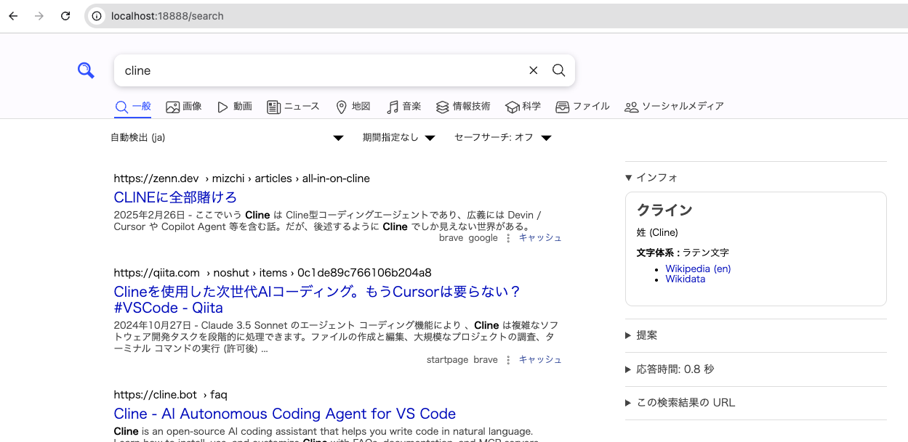

# SearXNG と Livebook による検索アプリケーション

このプロジェクトは、 SearXNG 検索エンジン、 Livebook 、 Ollama を組み合わせて、ウェブ検索と LLM を統合したアプリケーションを構築します。

## 環境構成

以下のコンポーネントを Docker コンテナとして実行します：

- SearXNG: メタ検索エンジン
- Livebook: 対話型 Elixir 開発環境
- Ollama: ローカル LLM サーバー

## セットアップ手順

1. リポジトリをクローンし、プロジェクトディレクトリに移動します：

```bash
cd ml-samples/oss-apps/searxng
```

2. docker-compose.yml ファイルを使用してコンテナを起動します：

```bash
docker compose up -d
```

## 使用するポート

各サービスは以下のポートで利用可能です：

- Livebook: http://localhost:8082 (管理用ポート : 8083)
- SearXNG: http://localhost:18888
- Ollama API: http://localhost:21434



## SearXNG API の使用方法

JSON 形式で検索結果を取得する例：

```bash
curl 'http://localhost:18888/search?q=検索キーワード&format=json'
```

## Livebook での開発

1. ブラウザで http://localhost:8082 にアクセス
2. 新しいノートブックを作成
3. 必要なパッケージをインストール：

```elixir
Mix.install([
  {:req, "~> 0.5"},
  {:ollama, "~> 0.8"},
  {:chunx, github: "preciz/chunx"},
  {:hnswlib, "~> 0.1"},
  {:kino, "~> 0.15"}
])
```

## 設定ファイル

- `docker-compose.yml`: コンテナの設定
- `searxng/settings.yml`: SearXNG の設定（ JSON 形式のレスポンスが有効化済み）

## 注意事項

- コンテナの初回起動時にはイメージのダウンロードが必要なため、時間がかかる場合があります
- Ollama を使用する場合は、必要なモデルを別途ダウンロードする必要があります
