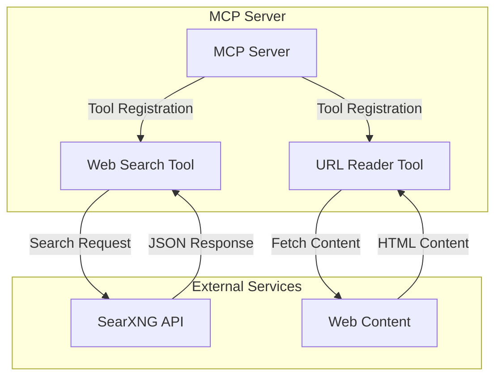
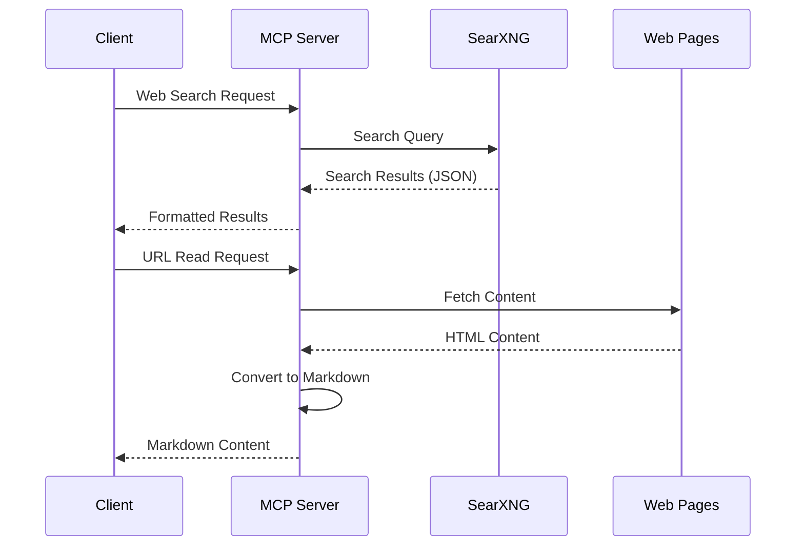
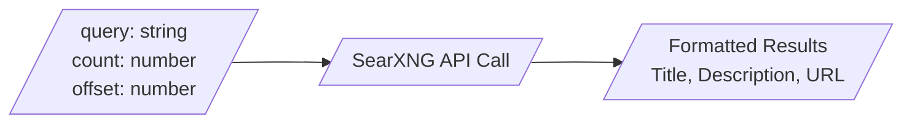
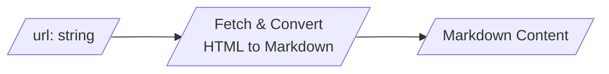
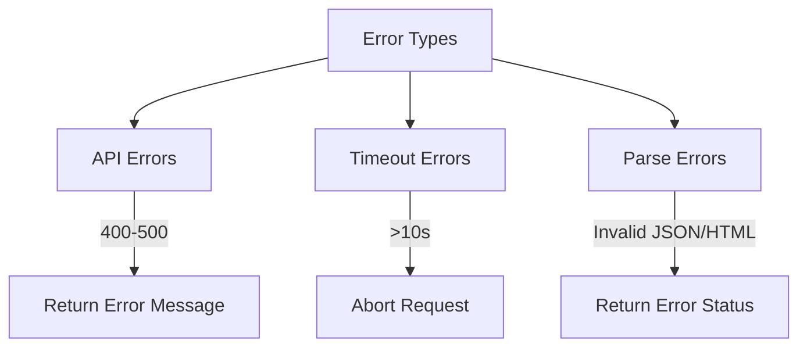
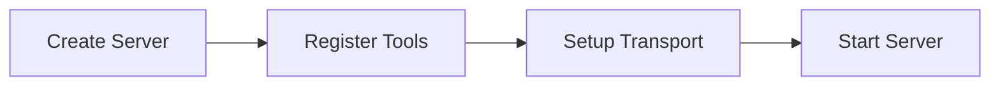
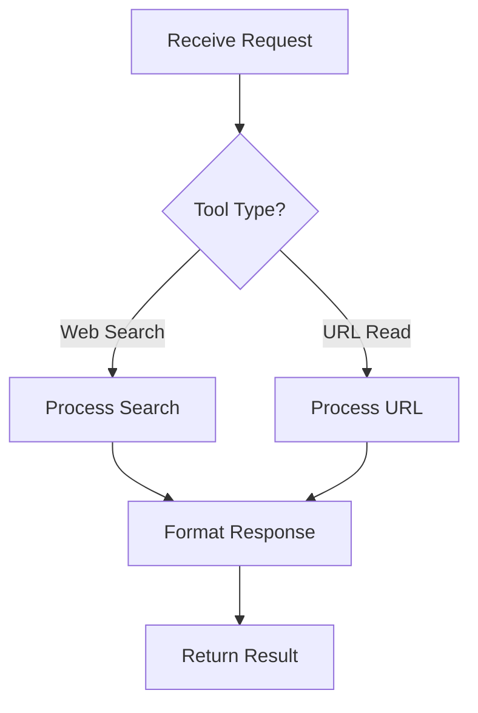

# SearXNG MCP Server

このプロジェクトは、SearXNG検索エンジンのAPIをModel Context Protocol（MCP）を通じて利用可能にするサーバーを提供します。

## システムアーキテクチャ



## データフロー



## ツール仕様

### Web Search Tool


### URL Reader Tool


## エラーハンドリング



## 実装の詳細

1. **初期化フロー**


2. **リクエスト処理**


## セットアップ

1. 依存関係のインストール：
```bash
npm install
```

2. 環境変数の設定：
```bash
export SEARXNG_URL=http://localhost:8888  # SearXNG APIのURL
```

3. MCPサーバーの設定：

MCPサーバーを登録するには、以下の設定をMCP設定ファイルに追加します。

- VSCode拡張機能の場合: `~/.local/share/code-server/User/globalStorage/saoudrizwan.claude-dev/settings/cline_mcp_settings.json`
- Claude Desktop Appの場合: `~/Library/Application Support/Claude/claude_desktop_config.json` (macOS)

```json
{
  "mcpServers": {
    "searxng": {
      "command": "node",
      "args": ["/path/to/mcp-searxng/build/index.js"],
      "env": {
        "SEARXNG_URL": "http://localhost:8888"
      },
      "disabled": false,
      "autoApprove": []
    }
  }
}
```

4. サーバーのビルドと起動：
```bash
# ビルド
npm run build

# 起動
npm start
```

## エラーハンドリング

- API接続エラー：SearXNG APIへの接続に失敗した場合
- タイムアウト：リクエストが10秒を超えた場合
- パースエラー：JSONやHTMLの解析に失敗した場合

各エラーは適切なエラーメッセージとともに返されます。
